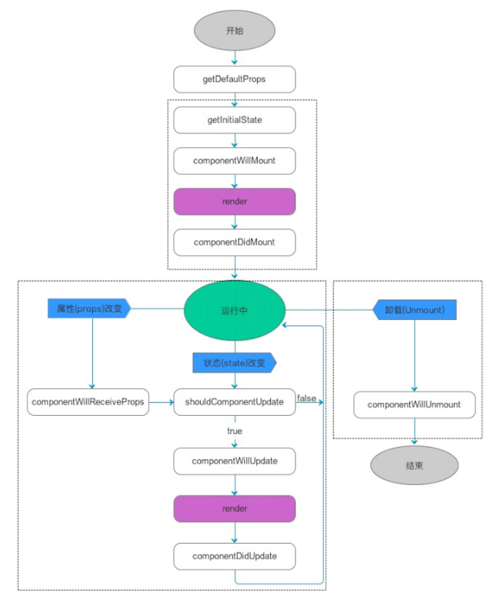
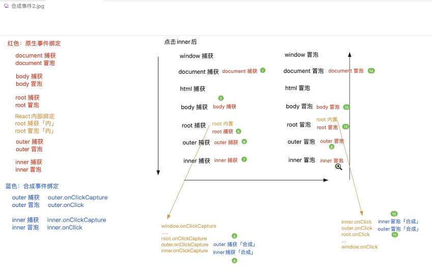
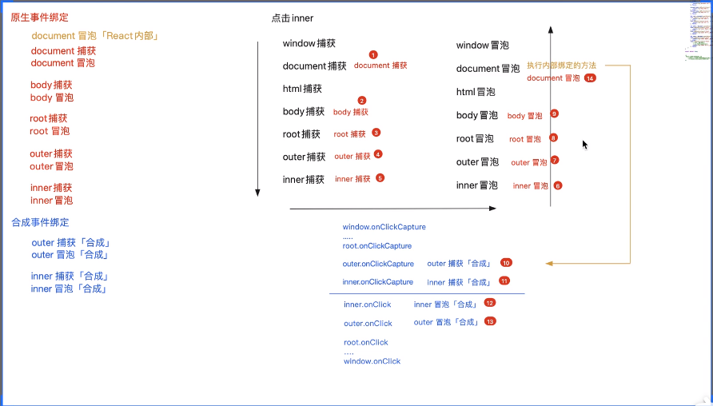

1. 循环相关知识
    - for-in循环：性能较差，既可以迭代私有的，也可以迭代公有的；且只能迭代可枚举的、非symbol类型的属性。。。
    - 获取对象所有私有属性（私有的，不论是否可枚举，不论类型）
        - Object.getOwnPropertyNames：获取对象非symbol类型的私有属性（无论是否可枚举）
        - Object.getOwnPropewrtySymbols: 获取对象Symbol类型的私有属性
        - 综上，获取对象所有私有属性ley keys = Obejct.getOwnPropertyNames(arr).concat(Object.getOwnProertySymbols(arr))
    - 基于es6中的Reflect.OwnKeys，缺点是不兼容IE
        - ley keys = Reflect.ownKeys(arr)

2. jsx底层渲染机制
    1. 把jsx通过babel-preset-react-app插件编译成虚拟dom
        - 通过babel-preset-react-app把jsx编译成`React.crateElement(type, props, children)`这种***格式***
        - 再通过执行`React.crateElement(type, props, children)`这个方法得到虚拟dom
            ```
            virtualDOM = {
                $$typeof: Symbol(react.element),
                ref: null,
                key: null,
                type: 标签名「或组件」,
                // 存储了元素的相关属性 && 子节点信息
                props: {
                    元素的相关属性,
                    children:子节点信息「没有子节点则没有这个属性、属性值可能是一个值、也可能是一个数组」
                }
            }
            ```
    2. 通过React.render()把虚拟dom渲染成真实DOM
        - v16:
        ```
        React.render(组件，挂载节点)
        ```
        - v18:
        ```
        let root = React.createDom(Document.getElementById('#root'));
        root.render(组件)
        ```
        - 第一渲染的时候是把整个虚拟dom全部渲染到屏幕上， 后面的改动都是先计算出两次虚拟dom之间的差异patch, 只对差异部分进行渲染

3. react的插槽
    通过双闭合标签的形式调用组件，在闭合符号之间添加DOM模拟插槽，以达到组件的高复用性
    - 在被调用的组件内部，props是被冻结的，可以结构出来children属性， 这个children属性就包含了调用组件时候在双闭合标签内传递进来的DOM
    - 在被调用的组件内部，使用插槽的时候， 需要借助`React.Children.toArray/count/foreach... `等方法进行处理并赋值给新的变量，后续就可以使用这个新的变量， 因为props结构出来的children有可能是undefiend, 有可能就是一个虚拟DOM, 有可能是一个虚拟dom数组
    ```
        // 实现
        const DemoOne = function DemoOne(props){
            // 注意： 传递进来的children都是编译后的虚拟DOM，而不是传递的标签DOM
            const {title, style, className, children} = props;
            ....
            ....
            // 用法1
            const newChildren = React.Children.toArray(children);

            // 用法2
            const headers = [];
            const footers = [];
            const others = [];
            React.Children.forEach(childVDom => {
                const {slot} = childVDom.props；
                if(slot === 'header'){
                    headers.push(childVDom);
                }else if(slot === 'footer'){
                    footers.push(childVDom);
                }else{
                    others.push(childVDom);
                }
            })
            ....
            return <>
                {headers}

                {newChildren[0]}

                <h2>啊哈哈哈哈哈</h2>
                ...

                {newChildren[1]}

                {footers}
            </>;
        }
        export default DemoOne;
    ```
    ```
    // 调用
        React.render(
            <>
                <DemoOne title='第一段' className='firstP'>
                    <span slot='footer'>我是页脚</span> // slot字段是给传递的插槽信息设置名字， 这个名字可以是任意的， 具名插槽可以在调用的时候不用考虑顺序，设置好对应的名字就行， 在实现插槽的组件内部可以任意使用
                    <span slot='header'>我是页眉</span>
                </DemoOne>
                
                <DemoOne title='第二段' className='secP'>
                    <span slot='other'>我是第二段</span>
                </DemoOne>

                <DemoOne title='第三段' className='thirdP'>
                </DemoOne>

            </>,
        root)
    ```
4. 可以通过设置组件的props的默认值和props的属性类型 进行规则校验
    - 进行规则校验前必须引入`import PropTypes from 'prop-types'`
    ```
    // props默认值
    DemoComponent.defaultProps = {
        title:'温馨提示'，
        num:1
        ...
    }
    ```
    ```
    // props属性类型约束
    DemoComponent.propTypes = {
        title: PropTypes.string,
        num: PropTypes.isOneOf([
            PropTypes.string.isRequired,
            PropTypes.number
        ])
    }
    ``` 
5. 类组件
    1. 创建一个构造函数
        - 必须继承React.Component/PureComponent
        - 给当前类设置一个render方法（是放在其原型上的）：在render方法中，返回需要渲染的视图
        - render方法在渲染的时候，如果type是
            - 字符串： 创建一个标签
            - 普通函数： 执行这个函数，并把props传递给函数
            - 构造函数：把构造函数基于new执行（创建一个类的实例），同时传递props
    2. 从调用类组件new DemoComponent({...})开始，类组件内部发生的事情：
        1. 初始化属性 & 设置规则校验(添加静态属性static defaultProps和static propTypes)
        2. 初始化状态
            - 状态： 后期修改状态， 可以触发试图的更新
            - 需要手动初始化，如果没有手动初始化， 会默认在实例上挂载一个state属性，初始值是null
            ```
            // 1. 可以直接添加属性
            state = {
                title: '你好哇'，
                id: 1
            }

            // 2. 或者在constructor函数中设置
                constructor(props){
                    super(props);
                    ...
                    this.state = {
                        title: '你好哇'，
                        id:1
                    }
                }
            ``` 
            - 修改状态， 更新视图
                - this.state.xxx = xxx 这种只能修改实例的state值， 并不能更新视图
                - 想要视图更新，我们需要基于`React.Component.prototype`提供的方法操作
                    - 第一种： `this.setState(partialState)`
                        - partialState: 部分状态
                        - this.setState({
                            xxx:xxxx
                        })
                    - 第二种： `this.forceUpdate()` 强制更新
    3. `类组件第一次渲染的底层逻辑`
        1. 触发`componentWillMount`周期钩子函数
            - 这个周期函数是不安全的，不建议使用
            - 目前可以使用， 但是控制台会抛出黄色警告
            - 不想要这个黄色警告的话， 可以暂时在这个钩子函数名称前面加上`UNSAFE_`
            - 但是如果开启了`React.StrictMode`模式，即便加了前缀控制台也会抛出红色错误
            - 这个`componentWillMount`会在第一次渲染之前执行（会在第一次执行render函数之前执行）
        2. 执行`render`周期函数, 进行渲染
        3. 执行`componentDidMount`周期函数
            - 第一次渲染完成，已经把virtualDOM变为真实DOM了，所以这个阶段可以获取到真实DOM了
    4. `组件更新的逻辑`:
        - 当在组件内部修改了组件状态state，组件会更新
            1. 触发`shouldComponentUpdate(nextProps, nextState)`周期函数
                - nextState存储要修改的最新状态， 此时this.state还是修改前的状态还没有改变
                - shouldComponentUpdate这个周期函数需要返回true/false
                    - true: 允许更新，会继续执行下一个操作
                    - false: 不允许更新， 接下来啥都不处理
            2. 触发`componentWillUpdate(nextProps， nextState)`
                - 这个阶段this.state也还没有被改变
            3. 修改this.state/属性值为最新的
            4. 触发render周期函数：组件更新
                - 按照最新的状态、属性值，把返回的JSX编译为virtualDOM
                - 把和上一次渲染出来的virtualDOM改进型对比DOM_DIFF
                - 把差异的部分进行渲染，渲染成真实的DOM
            5. 触发`componetDidUpdate`周期函数
        - 当父组件更新，触发了子组件的更新
            1. 触发子组件的`componentWillReceiveProps(nextProps)`
            2. 触发`shouldComponentWillUpdate`
            3. 触发`componentWillUpdate`
            4. 修改状态state/属性值
            4. 触发`render`
            4. 触发`componentDidUpdate`
        - 特殊说明：如果是基于`this.forceUpdate()`进行强制视图更新，会**跳过shouldComponetUpdate**周期函数的校验， 直接从**componentWillUpdate**开始进行更新，也就是说一定会进行视图更新
        - `深度优先原则`：父组件在操作中，遇到子组件，一定是把子组件操作完毕，才会继续父组件的后续操作
            - 父组件第一次渲染：
                - 父willmount  -->
                - 父render  -->
                    - 子willmount -> 子render -> 子didmount
                - 父didmount
            - 父组件更新
                - 父shouldUpdate  -->
                - 父willUpdate  -->
                - 父render  -->
                    - 子willReceiveProps -> 子shouldUpdate -> 子willUpdate -> 子render -> 子didUpdate -> [子setState.callback]
                - 父didUpdate
                - [父setState.callback]
6. react生命周期
        
7. 函数组件是静态组件， 类组件是动态组件
        - 静态组件：组件第一次渲染完毕后，无法基于'内部的某些操作'让组件自更新， 但是如果调用他的父组件更新了， 那么相关的子组件如果用到了相关改变的props也会跟着更新
            - 函数组件具备：属性，其他状态等几乎没有
            -函数组件处理机制简单，所以渲染速度很快
        - 动态组件：组件在第一次渲染完后，除了父组件更新可以触发其更新，也可以通过修改状态state或者forceupdate等方式， 让组件实现自更新
            - 类组件具备：属性，状态，周期函数，ref......
            - 类组件功能强大
        - hook组件：集合了函数组件和类组件的优势，在函数组件的基础上， 基于hook函数，让函数组件也可以拥有状态，周期函数等，让函数组件也可以实现自更新（动态化）
8. `React.PureComponent`与`React.Component`区别
    - purecomponent组件会默认添加shouldUpdateComponent周期函数，在这个函数中，他对新老的属性、状态会做一个`浅比较`， 如果新老没有变化，就会返回false,不会更新组件
    - 浅比较：只比较对象的第一级
    - 如果是purecomponet组件的render中某个部分依赖于state下面的一个数组属性arr的话，可能会造成这个相关视图不会改变， 因为purecomponent组件中自动添加了shouldUpdateCompont，他在这里浅比较这个state下面的arr，比较的是arr的内存地址，地址没有改变，即便此时arr的内存地址对应的实际数据已经改变了，也不会被浅比较判定为改变，所以视图不会被给改变
    - 可以使用`this.forceUpdate`或者`this.setState({arr: [...arr]})`来改变被依赖的arr的内存地址来让浅比较通过，从而改变视图
9. ref
    - 受控组件：基于数据、状态，更新视图； 非受控组件：基于ref获取DOM元素进行操作
    - 第一种： 在render中给目标元素设置ref='xxx'，后续从this.refs.xxx获取对应的DOM,不推荐使用 
        ```
        // 设置
        <div ref='xxx'></div>
        // 获取
        this.refs.xxx
        ```
    - 第二种： 设置ref的时候设置为一个函数, 获取的DOM元素是**直接挂在实例上的**
        ```
        // 设置
        <div ref={x=>this.xxx=x} > </div>
        // 获取
        this.xxx
        ```
    - 第三种：基于React.createRef创建一个ref对象
        ```
        // 设置
        this.xxx = React.createRefv();
        <div ref={this.xxx} > </div>

        // 使用
        this.xxx.current

        ```
    - 原理：在render的时候，会获取virtualDOM的ref属性
        - 如果属性是一个字符串，则会给this.refs增加这个名称的成员，值就是DOM元素
        - 如果属性是一个函数，则会执行这个函数，把DOM元素传递这个函数，把DOM元素挂在这个实例的这个名称的属性上
    -  注意：
        - 给标签元素设置ref, 可以直接获取到对应的DOM元素
        - 给类组件设置ref，可以获取组件的实例(不是DOM元素)，后续可以获取子组件中的相关信息
        - 给函数组件设置ref，会报错
            - 但是可以给子组件外面包上`React.forwardRef()`，可以让父组件获取到子组件内部的DOM元素
                ```
                // 定义
                const Child = React.forwardRef(function Child(props, ref){
                    return <div>
                        <button ref={ref}></button>
                    </div>
                });

                // 使用
                class Demo extends React.Component {
                    render(){
                        return <div>
                            <Child ref={ x=>this.child1=x }></Child> //这里this.child1获取到的就是函数组件Child内部的<button ref={ref}></button>
                        </div>
                    }
                }
                ```
10. 关于setState
    - `this.setState([partialState],[callback])`
        - partialState: 支持部分状态更改
        - callback: 在状态更改，试图更新完成后触发执行
            - 也就是在componentDidUpdate周期函数执行完成后触发callback
            - 即便基于shouldComponetUpdate阻止了状态、视图的更新， didUpdate不会执行了，但是这个callback只要设置了就会被触发执行 --->也就是说只要setState执行了callback就会被触发
    - `this.setState(preState => {return {....}})`
        - setState也可以传递一个函数，参数是上一次的状态值，返回值是要修改的属性， 支持部分属性修改
    - 在react18中， setState在任何地方执行，都是异步操作
        - react18中有一套**更新队列的机制**
            - 在当前相同时间段内（浏览器此时可以处理的事情中），遇到setstate会立即放入到更新队列中
            - 此时状态、视图还没有更新
            - 当所有代码操作结束，会刷新队列（通知更新队列中的任务执行）：把所有setState合并到一起执行，只触发一次试图更新（批处理）
        - 基于异步操作（不论是在哪执行，例如合成事件，周期函数，定时器），实现状态的批处理。
        - 每次调用setState不会立即更新状态和视图（setstate执行后立即打印被修改的状态值会发现还没有变化），而是先加入到更新队列中，当上下文的同步代码处理完毕后会统一渲染/更新一次（批处理）
        - 好处：
            - 减少视图的更新，降低渲染消耗的性能
            - 让更新的逻辑和流程更加清晰和稳健
    - 在react18 和 react16 中关于setState是同步还是异步是有区别的
        - 在react18中：setState不管在什么地方执行都是基于更新队列实现异步更新渲染的
        - 在react16中：
            - 如果setState是在**合成事件**（jsx元素中基于onxxx绑定的事件），**周期函数**中，setState是**异步**的
            - 如果setState是在其他异步操作（比如**定时器**，**手动获取dom元素做的绑定事件addeventlistener**等），setState将变成**同步**的，会立即更新状态并且让视图更新 
    - `flushSync(()=>{this.setState....})`
       - flushSync会立即刷新更新队列，并强制刷新一下状态、视图的刷新
       ```
       import {flushSync} from 'react-dom'

        this.state = {
            x：0
        }
        handle = () => {
            this.setState({x:1}); // this.state.x是0，视图也不刷新
            this.setState({x:2}); // this.state.x是0，视图也不刷新
            flushSync(()=>{
                this.setState({x：3}) // this.state.x是0，视图也不刷新
            })

            // 因为上一步执行快乐flushSync，所以强制执行了一次状态更新和视图刷新，此时this.state.x是3
            this.setState({x：4})// this.state.x是3，视图也不刷新，但在整个handle执行完毕会变成4

            // 至此 在这个handle中前3个setState被添加到更新队列中，并被合并到一次批处理中做了一次属性更新和视图渲染，第4个setState也被加到了更新队列中，单独做了一次属性更新和视图渲染
       }
       render(){
        return <div>
            x:{this.state.x}
            <button onClick={this.handle}>点击</button>
        </div>
       }
       ```
       ```
       import {flushSync} from 'react-dom'

        this.state = {
            x：0
        }
        handle = () => {
            // 这个for循环执行完成后，this.state.x是1，且视图也只会渲染一次
            for(let i=0; i<20; i++>){
                this.setState({x：this.state.x+1})
            }
       }

       render(){
        return <div>
            x:{this.state.x}
            <button onClick={this.handle}>点击</button>
        </div>
       }
       ```
       ```
       import {flushSync} from 'react-dom'

        this.state = {
            x：0
        }
        handle = () => {
            // 这个for循环执行完成后，this.state.x是20，且视图渲染***一次***
            for(let i=0; i<20; i++>){
                this.setState(preState => {
                    return {x: preState.x+1}
                })
            }
       }

       render(){
        return <div>
            x:{this.state.x}
            <button onClick={this.handle}>点击</button>
        </div>
       }
       ```

11. 合成事件synctheticBaseEvent
    - 在react中围绕浏览器的原生事件进行包装，实现跨浏览器的事件做统一API处理
    - 在jsx中对元素添加onxxx类型的事件 
        - 在onxxx事件的时候，如果对应的处理函数是`普通函数`，需要使用`.bind(this/null,xxx,xxx...)绑定`，或者对应的处理函数写成`箭头函数`形式
            - 经过bind绑定的处理函数，最后一个参数就是合成事件对象
    - synctheticBaseEvent对象：包含了浏览器内置事件对象中的一些属性和方法
        - clientX/clientY
        - pageX/pageY
        - target
        - type
        - preventDefault
        - stopPropgation
        - nativeEvent -->原生的浏览器事件
        - ...
    - 事件委托
        - 事件传播机制：捕获 -> 目标 -> 冒泡
        - stopPropgation可以阻止事件的传播
        - stopImmediatePropgation也可以阻止事件的传播，同时还可以把**当前元素绑定的其他事件**如果未执行，也阻止掉
        - 事件委托：利用事件的传播机制，实现一套事件绑定处理方案  --> 利用冒泡传播，给容器添加事件，再根据触发事件的事件源e.target做相应处理
        - 事件委托可以提高js代码运行性能， 并且能把事件处理逻辑集中到一起
        - 事件委托可以给动态添加的元素做事件处理，就不需要在新增这个元素的时候给他添加事件绑定了
        - 事件委托必须是支持冒泡机制的事件才可以实现，如mouseenter/mouseleave是没有冒泡传播机制的
        - 如果单独绑定的事件中做了阻止事件传播，那么事件委托中的操作也不会生效了
    - `合成事件原理 - react17及以后版本` 
        - react中的合成事件都是基于事件委托处理的，对于没有事件传播机制的事件才会单独做的事件绑定（比如mouseEnter、mouseLeave...）
            - 在react17及之后，都是**委托给root这个容器**，**捕获和冒泡**都做了委托
            - 在react17之前，都是**委托给document这个容器**，且**只在冒泡阶段**做了委托
        - 在组件渲染的时候，如果发现JSX元素属性中有onxxx/onxxxCapture这样的属性，就不会给当前元素直接做事件绑定，只把绑定的方法赋值给元素的相关属性，然后对root这个容器做了事件绑定（捕获和冒泡阶段都做了绑定）。
            - 原因： 因为组件所渲染的内容最终都会插入到root容器中，这样点击页面任意一个元素，最终都会触发root的相关事件。而在给root绑定的方法中，把之前给元素设置的onxxx/onxxxCapture属性，在相应阶段执行就行了！
            - 原理：
            ```
            // 经过视图渲染解析，把每个合成事件转换成组件的属性，如下：（ 注意这个时候的onClick/onClickCapture不是事件绑定，而是设置属性）
            outer.onClick = ()=> {console.log(outer 合成事件 冒泡)}
            outer.onClickCapture = ()=> {console.log(outer 合成事件 捕获)}
            inner.onClick = ()=> {console.log(inner 合成事件 冒泡)}
            inner.onClickCapture = ()=> {console.log(inner 合成事件 捕获)}
            ....

            // 给root做事件绑定
            // 1.捕获阶段的委托
            root.addEventListener('click', evt => {
                const path = evt.path； // path: [事件源,上一级元素，再上一级元素，..., window]
                 const syntheticBaseEvt = react内部对原生事件对象evt进行包装处理(evt);
                [...path].reverse().forEach(ele => {
                    const handle = ele.onClickCapture;
                    if(handle) {
                        handle(syntheticBaseEvt);
                    };
                })
            }, true);
            // 2. 冒泡阶段的委托
            root.addEventListener('click', evt => {
                const path = evt.path；
                const syntheticBaseEvt = react内部对原生事件对象evt进行包装处理(evt);

                // 冒泡阶段不需要对path进行reverse
                [...path].forEach(ele => {
                    const handle = ele.onClick;
                    if(handle) {
                        handle(syntheticBaseEvt);
                    };
                })
            }, false);

            // 注意1：冒泡阶段path不需要做reverse
            // 注意2： handle执行的时候,如果jsx中设置的处理事件函数是普通函数且没有绑定this，那么handle执行时候的this就是undefiend,如果jsx中设置的是箭头函数，那么this就会去执行上下文中找this,就会指向组件实例
            ```
            - 总结：所谓合成事件绑定，其实并没有给元素本身做事件绑定，而是给元素设置onxxx/onxxxCapture这样的合成事件属性。当事件行为触发，根据原生事件传播机制，都会传播到root容器上，react内部利用事件委托，给root做了事件绑定（捕获和冒泡）。当react内部绑定的方法执行的时候，会根据事件源的evt.path分析的路径，依次把对应阶段的onxxx/onxxxCapture事件出发执行
            - 
            - 合成事件中的e.stopPropgation: 既可以阻止原生事件的传播，也可以阻止合成事件的传播
            - 合成事件中的e.nativeEvent.stopPropgation：只能阻止原生事件的传播
            - 合成事件中的e.nativeEvent.stopImmediatePropgation:阻止原生事件的传播，且同时阻止root本身绑定的其他原生事件的传播
    - `合成事件原理 - react17之前版本` 
        - 在17以下版本中，合成事件的处理机制，不再是把事件委托给root,而是委托给document元素，并且只做了冒泡阶段的委托。在委托的方法中，把onxxx/onxxxCapture合成事件的属性进行执行
        - 原理：
        ```
         // 经过视图渲染解析，把每个合成事件转换成组件的属性，如下：（ 注意这个时候的onClick/onClickCapture不是事件绑定，而是设置属性）
            outer.onClick = ()=> {console.log(outer 合成事件 冒泡)}
            outer.onClickCapture = ()=> {console.log(outer 合成事件 捕获)}
            inner.onClick = ()=> {console.log(inner 合成事件 冒泡)}
            inner.onClickCapture = ()=> {console.log(inner 合成事件 捕获)}
            ....
        // 给document做冒泡阶段的事件委托
         document.addEventListener('click', evt => {
                const path = evt.path； // path: [事件源,上一级元素，再上一级元素，..., window]
                const syntheticBaseEvt = react内部对原生事件对象evt进行包装处理(evt);
                
                //1. 在冒泡阶段到达document节点的时候，先对捕获阶段的合成事件执行
                [...path]。reverse().forEach(ele => {
                    let handle = ele.onClickCapture;
                    if(handle){
                        handle(syntheticBaseEvt);
                    }
                })
                // 2.在冒泡阶段到达document节点的时候，再冒泡阶段的合成事件执行
                [...path].forEach(ele => {
                    let handle = ele.onClick;
                    if(handle){
                        handle(syntheticBaseEvt);
                    }
                })；
            }, false);

        ```
        - 
        - 合成事件中的e.stopPropgation: 既可以阻止原生事件的传播，也可以阻止合成事件的传播
        - 合成事件中的e.nativeEvent.stopPropgation：只能阻止原生事件的传播
        - 合成事件中的e.nativeEvent.stopImmediatePropgation:阻止原生事件的传播，且同时阻止document本身绑定的其他原生事件的传播
    - 合成事件17版本前后的其他区别：
        - react16中，关于合成事件对象的处理，react内部是基于'事件对象池'，做了一个缓存机制，react17及以后，去掉了这个事件对象池和缓存机制的。
            - 无论16还是17及以上，当每一次事件触发的时候，如果传播到了委托元素root/document上，在委托的方法中，react首先会对原生事件对象最统一处理，生产合成事件对象
            - 在16版本中：为了防止每一次重新创建出新的合成事件对象，他设置了一个合成事件对象缓存池
                - 事件触发到委托元素后，先从合成事件对想缓存池中取出一个对象，并把原生时间对象的一些信息赋值给这个合成事件对象相关的成员
                - 等待事件操作结束，会把这个合成事件对象成员信息全部清空null,再放入合成事件对象池中
            - 再react16中，有时候还想继续使用这个对象，不想清空这个合成事件对象的话，可以使用`syntheticEvt.persist()`进行保留
