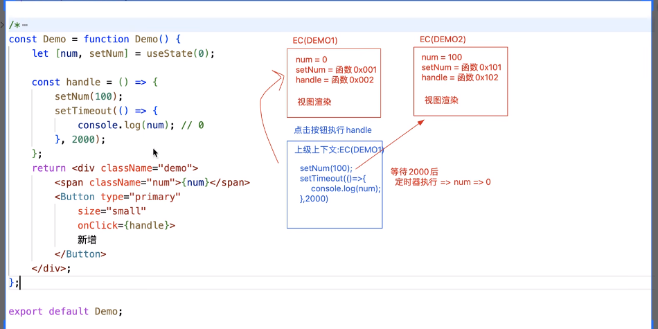

1. Hook函数：基于React中提供的Hook函数，可以`让函数组件动态化`.
    - Hook是在react16.8中新增的特性，并且只能运用在函数组件中
    - 基础hook:
        - useState
        - useEffect
        - useContext
    - 额外的Hook
        - useReducer
        - useCallBack
        - useMemo
        - useRef
        - useIMparetiveHandle
        -useLayoutEffect
        - ...
    - 自定义hook
2. `useState`
    - 作用：在函数组件中使用状态，后期可以修改状态值让组件更新， 类似于类组件中的setState
    - 示例 
        ```
        const [状态值, 修改状态值的方法] = useState(initialVal)
        // 执行这个'修改状态值的方法'：修改了状态值，并且通知视图更新
        // 这个'修改状态值的方法'： 可以是直接设置一个值， 还可以是一个函数，第一个参数是上一次的状态值，返回值是我们要修改的值。类似于类组件的this。setState的第二个参数

        const [num,setNum] = useState(1);
        ...
        setNum(num+1);
        setNum(prev => { return prev+1;})


        const [状态值, 修改状态值的方法] = useState(initialValFunction);
        ```
    - useState函数式更新
        ```
        // useState函数式更新：如果新的state需要基于之前的state计算得出，可以通过战术时更新传递给更新函数，该函数接受之前的state，并返回一个更新后的值。
        const [num setNum] = useState(1);
        setNum( prev => {
            return prev + 1；
        })
        ```
    - useState惰性初始化state
        ```
        // 如果初始化state需要通过复杂运算得出，则可以通过传入一个函数，在函数中计算并返回初始的state，此函数只在初始渲染时被调用一次。
         const [num, setNum] = useState(() => {
            ...
            return xxx;
         });
        ```
    - 函数组件、hooks组件都不是类组件，所以没有实例的概念（调用函数组件不再是创建类的实例，而是把函数执行，产生一个私有上下文而已），所以，在函数组件中不涉及this的处理
    - `useState底层处理机制`：**函数组件的每一次渲染(或者更新)，都是把函数(重新)执行一遍，产生一个全新的私有上下文**
        - 函数组件内部的代码需要重新执行
        - 涉及的函数需要重新的构建（这些函数的作用域(上下文)，是每一次函数组件执行产生的闭包）
            - 执行useState, 只有第一次会使用设置的initialValue，其余以后再执行，获取的状态都是最新的状态值而不是初始值
            - useState返回的修改状态值的方法， 都一次都是返回新的
        - 实现原理：
            ```
            var _state;
            function useState(initValue){
                if(typeof _state === undefined) 
                {
                    // 由此可见， useState的初始值/初始函数，进行了惰性处理，只会执行一次，以后组件更新都不会再执行了
                    if(typeof initValue === 'function'){
                        _state = initvalue();
                    }else{
                        _state = initValue;
                    }
                }
                var setState =  fucntion setState(value){
                    _state = value;
                    // 通知视图更新
                    ...
                }
                ...
                return [_state, setState];
            }
            ```
        - 
    - useState执行的时候，传递的是啥值，就把整体改成啥值，不支持部分状态的更新
        - useState不会像类组件的this.setState那样支持部分状态的更新
        - 可以先把旧的状态值...展开后，再添加新的状态值就行了
            ```
            useState( { ...state,
                 title:newVal
            });
            // 官方不建议这样一次性执行，官方建议创建多个状态分别修改执行
            ```
    - useState的同步和异步
        - 在react18中，我们基于useState创建的'修改状态的方法'，他们的执行是异步的
            - 原理：等同于类组件的this.setState,基于异步操作和更新队列，实现状态的批处理
            - useState在任何地方修改状态，都是异步的
        - 也可以使用`flushSync()`清空更新队列，立马强制刷新视图，实现一次同步
            ```
                // 在react18中
                const clickHandle = function clickhandle(){
                    const [x，setX] = useState(10);
                    const [y，setZ] = useState(20);
                    const [z，setZ] = useState(30);
                    ...
                    // 这个setTimeout里面的三个set执行， 只会触发一次视图更新
                    setTimeout(()=>{
                        setX(x+1);
                        setY(y+1);
                        setZ(z+1);
                    })
                }
            ```
            ```
            // 在react18中
            import {flushSync} from 'react-dom'
                const clickHandle = function clickhandle(){
                    const [x，setX] = useState(10);
                    const [y，setZ] = useState(20);
                    const [z，setZ] = useState(30);
                    const [m，setM] = useState(40);
                    ...
                        setX(x+1);
                        flushSync(()=>{
                            setY(y+1);
                            setZ(z+1);
                        });
                        setM(m+1);

                        // 上面会执行两次渲染render
                        // 第一次是setX和FlushSync里面包的setY，setZ
                        // 第二次是setM
                }
            ```
        - 在react16中，useSatate和类组件中的this.setState一样，在合成事件中是异步的，但是在定时器和手动获取dom元素绑定事件中是同步的
            ```
                // 在react16中
                const clickHandle = function clickhandle(){
                    const [x，setX] = useState(10);
                    const [y，setZ] = useState(20);
                    const [z，setZ] = useState(30);
                    ...
                    // 在react16中，这个setTimeout里面的三个set执行，是同步的，会触发三次渲染render的执行
                    setTimeout(()=>{
                        setX(x+1);
                        setY(y+1);
                        setZ(z+1);
                    })
                }
            ```
            ```
            // 在react16中
            import {flushSync} from 'react-dom'
                const clickHandle = function clickhandle(){
                    const [x，setX] = useState(10);
                    const [y，setZ] = useState(20);
                    const [z，setZ] = useState(30);
                    const [m，setM] = useState(40);
                    ...
                        setX(x+1);
                        flushSync(()=>{
                            setY(y+1);
                            setZ(z+1);
                        });
                        setM(m+1);

                        // 上面会执行两次渲染render
                        // 第一次是setX和FlushSync里面包的setY，setZ， 这三个set合并成一次批处理
                        // 第二次是setM
                }
            ```
    - useState的函数更新和优化机制
        - useState自带了性能优化机制：每一次修改状态值的时候，会拿最新要修改的值和之前的状态值作比较(基于`Object.is`作比较)
            - 如果发现两次值是一样的，则不会修改状态，也不会更新视图(类似于类组件的pureComponent的shouldComponentUpdate中做了浅比较和优化)
            - 为啥基于Object.is比较呢，是为了排除NaN!=NaN这种情况下的触发状态更改导致视图更新
        - 几个栗子
            ```
            const Demo = function Demo(){
                console.log('render渲染')；
                const [x, setX] = useState(10);
                const handle = ()=>{
                    for(let i=0;i<10; i++>){
                        setX(x+1);
                    }
                }
                //点击一次button执行这个循环，执行完后，最终只执行了一次'render渲染'，x变成11。这是因为每一次循环在setX执行的时候都会向上一级上下文环境中找x, 而上一级上下文环境的x都是次初始设置的那个10，而且因为useState自带的比较机制， 所以循环结束后，其实只渲染了一次, 所以最终x变成了11
                return <div>
                    <span>{x}</span>
                     <button onclick={handle} />
                </div>
            }
            ```
            ```
            const Demo = function Demo(){
                console.log('render渲染')；
                const [x, setX] = useState(10);
                const handle = ()=>{
                    for(let i=0;i<10; i++>){
                        flushSync(()=>{
                            setX(x+1);
                        });
                    }
                }
                //这个循环执行完后，最终只执行了2次'render渲染'，x变成11。
                // 点击button开始执行handle里面的循环：
                    // 第一次循环的时候，上一级上下文的x是初始值10，执行setX(x+1)，新值是11，然后被flushSync强制刷新视图，执行一次'render渲染'
                    // 第二次循环的时候，上一级上下文的x还是初始值10，执行setX(x+1)，新值还是11，和上一次的值作比较发现一样，就不会更新视图了   ----> 课程对应35节28分左右的讲解，存疑 ！！！！！！！！
                return <div>
                    <span>{x}</span>
                    <button onclick={handle} />
                </div>
            }
            ```
            ```
            const Demo = function Demo(){
                console.log('render渲染')；
                const [x, setX] = useState(10);
                const handle = ()=>{
                    for(let i=0;i<10; i++>){
                       setX( prev => {
                            return prev+1；
                       })
                    }
                }
                //点击button, 这个循环执行完后，最终只执行了1次'render渲染'，x变成20
                return <div>
                    <span>{x}</span>
                    <button onclick={handle} />
                </div>
            }
            ```
        
