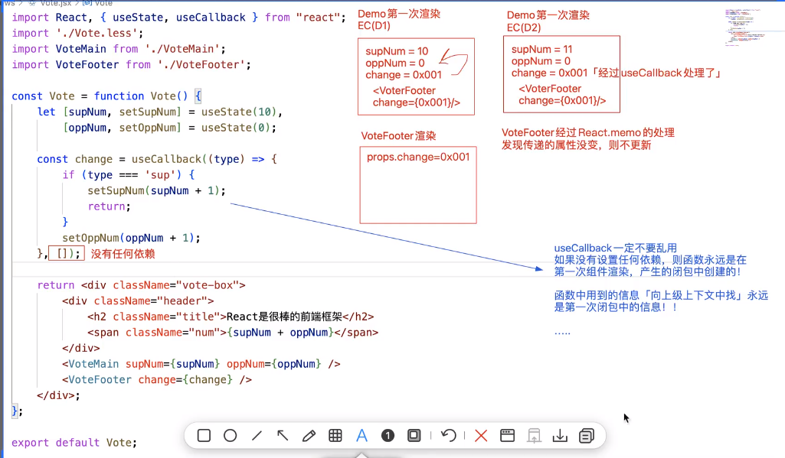

1. 父子组件的通信
    - 父 --> 子：
        - 基于props属性传递数据
        - 如果父亲想要传递一些HTML结构给儿子，可以使用插槽，在子组件中使用props.children解析出来
        - 父亲想要调用儿子的时候，可以给儿子设置ref，便可以获取儿子的实例（或者儿子中暴露的数据和方法）
    - 子 --> 父：儿子想要修改父亲，可以通过父亲传递进来的回调函数执行即可
2. `父子组件通信的核心思想 - 类组件`
    - 以父组件为主导，基于'属性'实现通信
        - 父组件基于属性，可以把信息传递给子组件（父 --> 子）
        - 父组件基于属性'插槽'，可以把HTML结构传递给子组件（父 --> 子）
        - 父组件把自己内部的方法传递给子组件，子组件把这些传递的方法执行（子 --> 父）
    - 父组件可以基于ref获取子组件的实例，或者子组件基于useImperativeHandle暴露出自己的属性和方法
    - `单向数据流`：
        - 属性的传递是单方向的，由父亲做主导传递属性，儿子可以借助父亲传递的方法实现儿子修改父亲
        - 生命周期： 基于深度优先
            - 第一次渲染： 父willmount -> 父render -> 子willmount -> 子render -> 子didmount
            -> 父didMount
            - 组件更新： 父shouldupdate -> 父willupdate -> 父render -> 子willreceiveprops -> 子shouldUpdate -> 子willupdate -> 子render -> 子didupdate -> 父didupdate
    - 所以如果子组件是类组件，且属性中接收了父组件传递的方法，那么子组件需要继承自React.PureComponent来进行性能优化，因为类组件只会创建一次，后续的状态修改视图更新都只是这个实例做操作，所以传递的属性如果只是函数的话，子组件不需要每次都跟着更新，使用React.PureComponet做一下性能优化
3. `父子组件通信的核心思想 - 函数组件`
    - 大致思想跟类组件的父子组件通信一样
    - 可以添加useMemo, useCallback等hook做一下优化
        - useCallback不要轻易使用 ！！！！！ 因为如果父组件中传递给子组件的方法用了useCallback做处理且没有设置依赖 且 子组件同时也做了React.memo处理，那么意味这个父组件传递的方法永远只是第一次创建的实例不会改变，子组件因为memo原因也不会更新，那么子组件在被鼠标事件或者其他改变的时候，子组件所处的闭包环境是上一次的缓存，就有组件不会正确的被更新了 ---> 利用usememo或者usecallback做性能优化的时候要注意加上依赖项
        - 
4. `祖先和后代组件的通信 - 类组件`
    - 基于上下文对象`React.createContext()`提供的`Provider`组件，把数据和方法设置在他的`value属性`上。当组件更新，render重新执行的时候，会把最新的状态值再次存储到上下文对象中
    - 使用方法：
        1. 创建一个上下文对象 let ThemeContext = React.createContext();
        2. 父组件中导入这个创建的上下文对象，并用他的Provider组件包裹父组件，在Provider组件的value属性中设置需要的属性和方法
        3. 后代组件先导入这个创建的上下文对象，再声明一个`静态的私有属性contextType`(必须叫这个)，然后就可以在后代组件实例的this.context中获取到祖先组件设置的属性和方法了
        4. 后代组件也可以使用这个创建的上下文对象提供的`ThemeContext.Consumer`组件来获取属性和方法，这个consumer组件中是一个函数，这个函数的参数就包含了上下文的数据和方法
        ```
            // 创建上下文对象
            let ThemeContext = React.createContext();
            export default ThemeContext;

            // 父组件中设置需要用的相关属性和方法到上下文中
            import ThemeContext from '@/ThemeContext.js'

            class Vote extends React.Component {
                state = {
                    oppNum:0,
                    supNum:10
                }

                render() {
                    let {supNum, oppNum} = this.state;
                    change = () => {
                        ....
                    }
                    return <ThemeContext.Provider value = {{
                        supNum,
                        oppNum,
                        change: this.change
                    }}>
                        <div>
                            <span>选举活动</span>
                            <VoteMain></VoteMain>
                            <VoteFooter></VoteFooter>
                        </div>
                    </ThemeContext.Provider>
                }
            }

            // 子组件中使用上下文中的属性和方法  1
            import ThemeContext from '@/ThemeContext.js' // 第一步 导入创建的上下文对象
            class VoteFooter extends React.Component {
                static contextType = ThemeContext; // 第二步，声明一个静态私有属性contextType

                render(){
                    let {oppNum, supNum, change} = this.context; // 第三部，在组件实例的context属性上获取父组件中设置的数据和方法
                    return <div>
                        <p>支持人数：{supNum}</p>
                        <p>反对人数：{oppNum}</p>
                    </div>
                }
            }
            // 子组件中使用上下文中的属性和方法  2
            import ThemeContext from '@/ThemeContext.js'
            class VoteFooter extends React.Component {
                render(){
                    return <ThemeContext.Consumer>
                        {
                            context => {
                                let {oppNum, supNum, onChange} = context;
                                 return <div>
                                    <p>支持人数：{supNum}</p>
                                    <p>反对人数：{oppNum}</p>
                                </div>
                            }
                        }
                       
                    </ThemeContext.Consumer>
                }
            }
        ```
5. `祖先和后代组件的通信 - 函数组件`
    - 大致方法和类组件一样， 都是使用`React.createContext()`创建上下文对象
    - 区别在于子组件中获取上下文的方式不一样， 函数组件中不能使用`static context = ThemeContext; this.context`获取上下文对象，因为函数组件中没有this。可以使用下面的方式获取：
        - 第一种，子组件中使用`ThemeContext.Consumer`的方式，跟上面类组件一样
        - 第二种：使用`useContext(ThemeContext)`获取
            ```
            // 子组件中获取上下文
            // import ThemeContext from '@/ThemeContext.js'
            const VoteFooter = function VoteFooter(){
                let {supNum, oppNum, change} = useContext(ThemeContext);

                return <div>
                        <p>支持人数：{supNum}</p>
                        <p>反对人数：{oppNum}</p>
                    </div>
            }
            ```