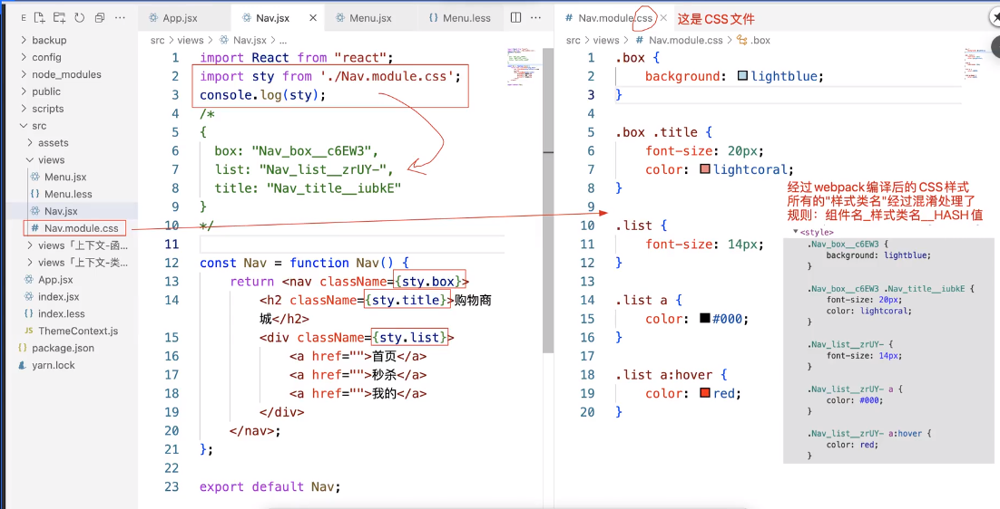
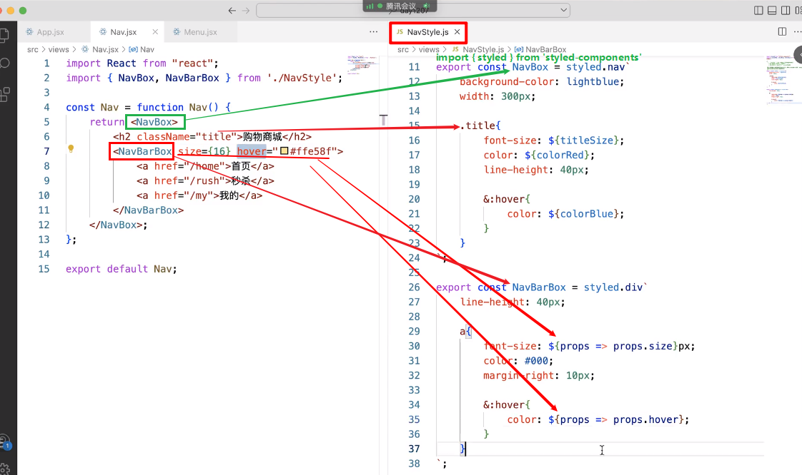

React样式私有化，有以下几种方法：
1. 内联样式：在jsx元素上直接写样式
    ```
    // 样式不是用的className = {{...}}, 而是直接使用style={{...}}
    <div style = {{background: red}}>哈哈哈</div>
    // 或者定义一个样式变量
    let Astyle = {
        color: blue,
        size: 20px
    }
    <div style={Astle}>哈哈哈哈</div>
    ```
2. 人为的有规范的避免样式冲突：
    - 保证每个组件最外层样式类名是不冲突的，使用路径+组件名作为最外层容器的名字，后期组件内部的样式都是技术less/sass/stylus嵌入到指定外层容器的样式类名下去编写
3. CSS Modules 
    - 样式都是写在`xxx.module.css`文件中,这样的文件是css文件，不能再使用less/sass/stylus这样的预编译语言了
    - 我们在组件中，基于ES6Module模块规范导入进来
        - import aaaStyle from './xxx.module.css';
        - aaaStyle存储的是一个对象
            - 键：在css文件中编写的样式类名 .box{}
            - 值：经过webpack编译后的样式类名 .Nav_box_c6Ew3{}，规则是`组件名_样式类名__HASH值`
    - 我们编写的css样式也会被编译，所有之前的样式，也都编译为混淆后的类名，加了和上述对象中编译后的值一样
    - 我们在组件中，所有元素的样式类，基于aaaStyle.xxx操作
    
    -  如果需要给一个jsx元素同时添加多个样式，需要使用大胡子语法 
        ```<div className={ `${aaaStyle.xxx} ${aaaStyle.yyy}` }>哈哈哈哈哈</div>```
    - 如果我们在xxx.module.css文件中写的样式不想被CSS Module编译后变成`组件名_样式类名__HASH值`这样的形式，需要借助global变成全局样式名，且名字不会被编译。虽然编译后在某一个style标签里面，但是可以被所有元素全局使用(被编译的样式其实也是全局的，只不过不会重名而已)
        ```
            .list a:hover {
                color: red;
            }
            :global(.clearfix){
                clear: both;
            }
        ```
    - 组合&&继承 --> composes：在编译的时候会把他组合的类一起加上 相当于组合了多个编译后的类名
        ```
        .box {
            color: red;
        }

        .buttonLink {
            composes: box;
            size: 14px;
        }
        ```
    
    - 实现原理：基于react-dev-utils里面的getCSSModuleLocalIdent.js实现
        - 把xxx.module.css文件里面写的css样式的类名通过编译混淆，保证唯一性，在jsx文件里面导入xxx.module.css文件后引入为一个对象，通过这样对象调用对应的类名即可
4. ReactJSS
    - 首先 安装react-jss这个node包
    - 在js文件中，基于createUseStyles这个方法，构建组件需要的样式；这个函数返回的是一个自定义hook函数
    - 执行这个函数后创建的对象中的每个成员就是创建的样式类名，是唯一的，box-2-2-1, box-0-2-2：hover
    - 可以类似于less等预编译语言中的嵌套语法，给其后代、伪类等设置样式
    ```
    import { createUseStyles } from 'react-jss';

    const useStyles = createUseStyles({
        box：{
            width: 300px，
            backgroundColor: 'red'
        },
        title: {
            fontSize: 20px，
            '&:hover': {
                color: 'green'
            }
        },
        list: {
            '& a': {
                color: 'blue'
            }
        }
    })
    const Nav = function Nav(){
        let {box， title, list} = useStyles();
        return <nav className={ box }>
            <div　className={ title }></div>
            <div　className={ list }>
                <a>1</a>
                <a>2</a>
            </div>
        </nav>
    }
    ```
    - 相对于cssModules，ReactJSS的好处是可以执行组件传进来的props的值，对样式做动态处理
    ```
    import { createUseStyles } from 'react-jss';

    const useStyles = createUseStyles({
        box：{
            width: 300px，
            backgroundColor: props => {
                return props.colorNum > 1 ? 'red' : 'blue'; // 注意：这里是一个函数，参数就是props,需要有返回值，返回值就是样式值
            }
        },
        title: {
            fontSize: 20px，
            '&:hover': {
                color: 'green'
            }
        },
        list: {
            '& a': {
                color: 'blue'
            }
        }
    })
    const Nav = function Nav(){
        let {box， title, list} = useStyles(); // 注意这里是函数组件，所以这个useStyles自定义hook组件才可以使用
        return <nav className={ box }>
            <div　className={ title }></div>
            <div　className={ list }>
                <a>1</a>
                <a>2</a>
            </div>
        </nav>
    }
    ```
    - `在类组件中，不能使用hook`，所以上述createUseStyles()这个执行结果useStyles只能在类组件中使用，在类组件中直接使用会报错
    - 在类组件中， 可以创建一个代理组件(函数组件)：获取基于ReactJSS编写的样式，把获取的样式基于属性传递给类组件
        ```
        import { createUseStyles } from 'react-jss';

        // js文件中基于reactJSS写样式
        const useStyles = createUseStyles({
            box：{
                width: 300px，
                backgroundColor: props => {
                    return props.colorNum > 1 ? 'red' : 'blue'; // 注意：这里是一个函数，参数就是props,需要有返回值，返回值就是样式值
                }
            },
            title: {
                fontSize: 20px，
                '&:hover': {
                    color: 'green'
                }
            },
            list: {
                '& a': {
                    color: 'blue'
                }
            }
        })
        
        // 类组件中调用
        class Menu extends React.Component {
            render(){
                 return <nav className={ box }>
                        <div　className={ title }></div>
                        <div　className={ list }>
                            <a>1</a>
                            <a>2</a>
                        </div>
                </nav>;
            }
        }

        // 代理一下类组件，把基于reactJSS写的样式通过属性传递给原始类组件
        const ProxyComponent = funciton ProxyComponent(Component){
            // Component: 真实要渲染的组件，比如 Demo, Menu
            // 这个代理组件执行后返回的一个函数组件: 我们在下面基于export default导出的是这个组件， 在App中调用的也是这个组件（HOC）

            return function HOC(props){
                let aaaStyle = useStyles();
                return <Component {...props} {...aaaStyle} />
            }
        }

        export default ProxyComponent(Menu)
        ```
    - `HOC：React高阶组件 --> 利用JS中的闭包(柯理化函数)实现的组件代理`
        - 对于类组件中的createUseStyles()产生的useStyles对象不能在类组件中使用的问题，我们可以在代理组件中，经过业务逻辑的处理，获取一些信息，最后基于属性等方案，传递给我呢吧最终要渲染的组件
5. styled-components
    - 首先安装`styled-components`这个包
    - 如果编写样式的时候没有提示，可以在vscode中安装官方插件vscode-styled-components
    

