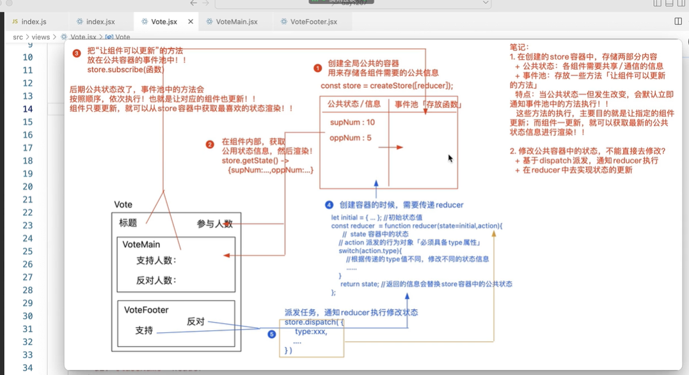

1. Redux实现公共状态管理
    1. 安装`redux`包
    2. 实现步骤： 创建公共状态 -> 订阅函数 -> 派发函数 ->获取状态
        - 1 创建全局公共的容器：用来存储各个组件需要的公共信息 `const store = createStore([reducer])`
            - 这个容器包含两部分：一部分是存储`公共状态/信息`
            - 另一部分是`事件池(存放函数)`
            - 创建容器的时候需要传递一个`reducer`函数
                ```
                let initial = { ... }// 初始状态值
                const reducer = function reducer(state=initialState, action){
                    // state:容器中的状态
                    // action: 派发的行为对象(必须具有type属性)
                    switch(action.type){
                        // 根据传递的不同type,修改不同的状态信息
                    }
                    return state；// 返回的信息会替换store容器中的公共状态
                }
                ```
        - 2 在组件内部，获取公共状态信息，然后渲染 `const { x } = store.getState()`
        - 3 把`让组件可以更新的方法`放在公共容器的事件池中 `store.subscribe(函数)`
        - 4 后期公共状态改了，事件池中的方法会按照顺序，依次执行，让对应的组件更新，组件只要更新，就可以从store容器中获取最新的状态渲染
            - 基于`dispatch`派发，通知`reducer`执行，在reducer中实现状态的更新
        ```
        //创建store
        import {createStore} from 'redux'

        let initial = {
            supNum: 10,
            oppNum:5
        }
        const reducer = function reducer(state=initial, action){
            // state:存储store容器中的公共状态，初始值是initial
            // action: 每一次dispatch派发的时候执行， 传递进来的行为对象必须要有type属性
            // 不要直接操作修改state, 应该在最开始把state克隆一份，最后return state的时候再返回这个克隆，用于整体替换state
            // 第一次派发，是在redux内部派发的，目的是初始化state(把initial赋值给state)。第一次派发传递的type不会跟任何业务逻辑的type匹配到
            state = deepClone(state);
            switch(action.type){
                case 'VOTE_SUP':
                    state.supNUm++;
                break;
                case 'VOTE_OPP':
                    state.supNUm++;
                break;
            }

            // return的内容，会整体替换STORE容器中的状态信息
            return state；

        }
        const store = createStore(reducer);

        export default store;
        ```
        
2. 借助上下文对象React.CreateContext()实现Redux的store传递
    - 因为APP是所有组件最终挂在的节点，所以可以在APP上绑定创建的上下文ThemeContext，并把全局的公共状态管理store放到这个上下文对象ThemeContext.Provider组件的value上，传递给后面所有的子孙组件
    - 在子孙组件中，类组件可以使用static contextType = ThemeContext 和this.context来获取到store对象，也可以跟类组件一样，使用ThemeContext.Consumer来获取到store; 如果子孙组件是类组件，还可以使用useContext(ThemeContext)来获取到store
        - 使用到公共状态的组件，必须要向store的事件池中加入让组件更新的办法，只有这样草可以确保，公共状态改变组件才会更新才可以获取最新的状态进行绑定
        - 类组件中向store中加入的让组件更新的方法，可以是this.forceUpdate()，函数组件中要特别注意添加依赖或者使用时间戳或者随机数设置一个不会重复的值来改变状态以实现让组件更新
            ```
            useEffect(() => {
                // let unsubscribe = store.subscribe(让组件更新的方法)
                //   + 把让组件更新的方法放在STORE的事件池中
                //   + 返回的unsubscribe方法执行，可以把刚才放入事件池中的方法移除掉
                let unsubscribe = store.subscribe(update);
                return () => {
                    unsubscribe();
                };
            },[num]);

            let [, setNum] = useState(0); // 因为只是想创建一个可以修改属性从而触发视图更新的方法，所以这里第一个参数省略了，定义一个setNum就行
            useEffect(() => {
                store.subscribe(() => {
                    setNum(+new Date()); // 这里用随机数或者时间戳都行，目的就是为了传递不会重复的值，从而修改属性触发视图更新
                });
            }, []);
            ```
3. redux源码解析
    ```
    export const createStore = function createStore(reducer){
        let state；//存放公共状态
        let listeners=[] // 事件池

        // 获取公共状态
        const getState() = function getState(){
            return state;
        }

        // 向事件池中加入让组件更新的方法
        const subscribe = function subscribe(listener){
            // 类型校验
            if(typeof listener !== 'function'){
                throw TypeError('Expected the listener to be a function...')

                // 去重
                if(!listeners.includes(listener)){
                    listeners.push(listener);
                }

                // 返回一个从事件池中移除‘让组件更新的方法’的函数
                return function unSubscribe(){
                    let index = listeners.indexOf(listener);
                    listeners.splice(index, 1);
                }
            }
        }；

        // 派发任务，通知reducer执行
        const dispatch = function dispatch(action){
            if(!_.isPlainObject(action)){ 
                thtow new TypeError('action must be plain object');
            }
            if(typeof action.type === 'undefined'){
                throw new TypeError('action may not have an undefined 'type' property);
            }

            // 把reducer执行，传递了所有公共状态和当前触发的行为对象，最后用返回的值，替换全局的公共状态state
            state = reducer(state, action);

            //当状态更改，我们还需要把状态池中的方法('让组件更新的方法')执行，通知组件获取最新的状态，从而更新视图
            listeners.forEach(listener => {
                listener();
            })

            return action;
        }

        // redux内部会默认进行一次dispatch派发，目的是为了给公共容器中的状态赋值初始值
        dispatch({
            // type: Synbol()   --> ES6中的做法
            type: ActionTypes.INIT,   --> "@@redux/INIT" + Math.random().toString(36).subString(7).split('').join(.) 唯一性 保证不会匹配到任何业务逻辑的type
        })

        // 返回创建的STORE对象
        return {
            getState,
            subscribe,
            dispatch
        };
    }
    ```
4. redux工程化 ： 
    - 4.1 reducer的拆分和合并
        - 按照模块，把reducer进行单独管理，每个模块都有自己的reducer,最后我们利用`combineReducers`把所有reducer合并为一个，赋值给我们创建的store
            ```
            // 合并各个模块的reducer
            import { combineReducers } from 'redux'；

            import persdsonReducer from './persdsonReducer';
            import voteReducer from './voteReducer';

            const reducer = combineReducers({
                vote ： voteReducer, // 合并时候设置的名字就会变成最后store中的成员名来管理每个reducer自己的数据
                person: personReducer
            })

            export default reducer;

            // 导出的这个reducer, 合并了所有reducer, 此时容器store中的公共状态会按照我们合并reducer时候设置的名字作为最终的成员名进行管理
            /**
                state = {
                    vote: {
                        supNum: 10,
                        oppNum: 5
                    },
                    person: {
                        num： 100，
                        info: null
                    }
                }
            **/
            ```
        - `combineReducers`源码解析
            ```
            const combineReducers = function combineReducers(reducers){
                let reducersKeys = Reflect.ownKeys(reducers);

                //返回一个合并的reducer
                return fucntion reducer(state={}, action){
                    // 把每一个reducer执行，传递进去reducer对应自己的模块的对象,然后把返回值替换reducer对应自己的模块的state
                    let nextState = {};
                    reducersKeys.forEach(key => {
                        let resucer = reducersKeys[key];
                        nextState[key] = reducer(state[key], action);
                    });

                    return nextState;
                }
            }

            export default combineReducers;

            ```
        - 派发的操作不需要改动，在dispatch的时候，会根据type逐一匹配所有的reducer中的action，和哪一个匹配成功就执行哪一个（存在问： type有可能会重名，这样需要自己去人为避免或者修改redux源码）
    - 4.2 派发行为标识宏管理
        - dispatch的时候，会把在所有reducer中匹配到的type执行一遍，所以要基于宏管理保证派发的行为标识要是唯一的
        - 创建一个单独的文件action-types.js单独管理所有的派发标识
            - 派发的标识命名一般是：模块名_标志名
    - 4.3 `actionCreator`的管理
        - 把简单store.dispatch({type: ActionTypes.VOTE})改成store.dispatch(action.vote.support());其中，action集中管理了所有模块的派发， 每一个模块的派发都写成了函数的形式，返回值就是我们最终需要的type+data
        - 这样的做法叫做创建actionCreator, 目前效果不明显，但是在react-redux中会非常有用


    
