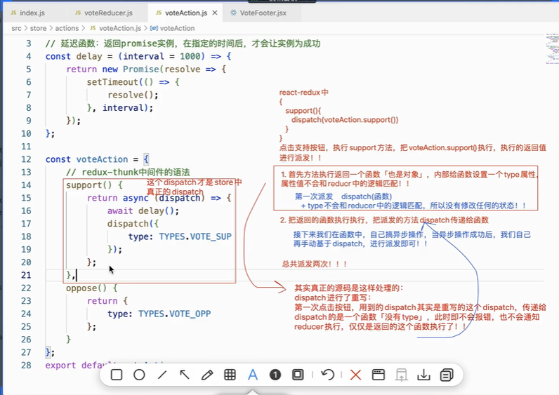

0. day1207 - day1209源码
1. `react-redux`: 更方便的在react中使用redux
    - 直接使用react-redux提供的`Provider`组件 并给这个组件设置`store`属性
    - 子组件中获取store, 基于react-redux提供的`connect(mapStateToProps,mapDispatchToProps)(组件)`函数就可
    - 而且也不需要我们手动添加'让组件更新的方法'到事件池中了，react-redux内部会自行处理
    ```
    // 父组件中传递store
    import { Provider } from 'react-redux';
    import store from './store'

    root.render(<ConfigProvider>
        <Provider store={store}> // 直接使用react-redux提供的Provider组件 并给这个组件传递store属性
            <Vote />
        </Provider>
    </ConfigProvider>)

    // 子组件中获取store, 基于react-redux提供的connext函数就可
    import { connect } from 'react-redux';
    import action from './store/actions';

    const Vote = function Vote(props){
        let {supNum, oppNum, support, oppose} = this.props；

        return <div>
            <span>{supNum+oppNum}</span>
            <button onClick = { support }>支持</button>
            <VoteMain />
            <VoteFooter />
        </<div>>
    }
    <!-- export default connect(state =>{
        supNum: state.vote.supNum
        info: state.person.info
    })(Vote)
     -->
    export default connect(
        state => {
            return state.vote; //替代上面一个一个赋值的写法，代表把state.vote下面所有的属性都传递给组件的属性
        },
         dispatch => {
            return {
                support(){
                    dispatch(action.vote.support())；// action.vote.support()执行的结果是一个对象{type:'sup'}
                },
                oppose(){
                    dispatch(action.person.oppose())；
                }
            }
        }
    )(Vote);

    // 对于connect第二个参数, 可以基于actionCreators, 简写成以下方式： ---> react-redux内部会通过bindActionCreators方法处理成上面第二个参数的那种原始写法
    export default connect(null,
         action.vote
    )(Vote);

    ```
2. `connect(mapStateToProps, mapDispatchToProps)(组件)`
    - mapStateToProps: 可以获取到redux中的公共状态，把需要的信息作为属性, 传递给组件,组件的props.xxx就可以获取到了
        ```
        connect(state=> {
            // state: 存储redux容器中，所有模块的公共状态信息
            // 返回值：就是要做为属性，传递给组件
            return {
                supNum: state.vote.supNum
                info: state.person.info
            }
        })
        ```
    - mapDispatchToProps: 把需要派发的任务，当作属性传递给组件
        ```
        connect(null ,dispatch => {
            // dispatch: store.dispatch派发任务的方法
            // 返回对象中的信息，会作为属性传递给组件
            return {
                xxxFunc() {
                    dispatch(action);
                },
                xxxFunc2() {
                    dispatch(action2);
                }
            }
        })
        ```
3. 归纳总结： todo - 65
4. `中间件`
    - 创建store的时候，传递中间件
        ```
        import { createStore, applyMiddleware } from 'redux'；
        import reducer from './reducer';
        import reduxLogger from 'redux-logger';
        import reduxThunk from 'redux-thunk';

        const store = createStore(reducer,
            applyMiddleware(reduxLogger, reduxThunk);
        );
        ```
    - redux-logger
        - 触发派发操作的时候会在控制台打印触发dispatch前后的状态和action
        - 只需要创建store的时候注册一下就行
    - redux-thunk
        - 支持组件的异步操作
        - 在dispatch操作中，返回的action不在是一个包含type属性的对象了，而是要求返回一个异步函数，在异步函数里面做一些目标异步操作后，再手动dispatch一个包含type属性的action对象
        
        - 点击支持按钮，执行support方法，把voteAction.support()执行，执行的返回值进行派发
            - 首先方法执行返回一个函数（也是一个对象），redux-thunk对dispatch进行了重写，第一次点击按钮，传递给dispatch的是一个函数（没有type）,此时不会报错，也不会通知reducer执行，仅仅是返回的这个函数执行了
            - 把返回的函数执行，把派发的方法dispatch传递给函数。接下来我们在函数中，自己搞异步操作,当异步操作成功后，我们自己再手动基于dispatch进行派发
            - 所以总共派发了两次
    - redux-promise
        - redux-promise可以让派发的函数最外层就可以是个异步函数，而不报错
            ```
            const voteAction = {
                support(){
                    return async (dispath) => {
                        await delay(1000);
                        dispatch({
                            type: 'sup',
                            data
                        });
                    };
                },
                // dispacth如果没有redux-promise中间件的话，这个oppose是不能直接加async变成异步操作的,会报错，因为promise实例是一个对象，没有type属性，所以匹配不到任何reducer的操作，会报错。（要么是个包含type属性的对象，要么是个同步函数）
                // 因为异步函数执行返回的是一个promise实例
                async oppose(){
                    await delay(1000);
                    return {
                        type: 'opp'
                    };
                }
            }
            ```
        - redux-thunk和redux-promise中间件，都是用于处理异步派发的
            - 都是派发两次
                - 第一次派发用的是重写后的dispatch，这个方法不会校验对象是否有type属性，也不在乎传递的对象是否为标准普通对象，此次派发只是为了第二次派发做准备
                - redux-thunk：把返回的函数执行，然后这个函数里面我们手动调用了真正的dispatch，并执行真正的业务派发逻辑。要求最外层的派发函数(比如support函数)必须是普通函数，这个普通函数返回的是一个异步函数，在这个异步函数里面做一些业务异步逻辑处理后，手动调用真正的dispatch进行派发
                - redux-promise：监听返回的promise实例，在实例完成后，需要基于真正的dispatch，把成功的结果，再进行派发。使用了resux-promise中间件，就可以直接把最外层的派发函数(比如oppose函数)变成异步函数了，在这个异步函数里面直接做业务异步逻辑，最后返回action对象即可，redux-promise会自动帮我们进行派发操作
5. 利用react-redux实现组件间通信和数据的存储
    - 项目练习：第66节课视频 