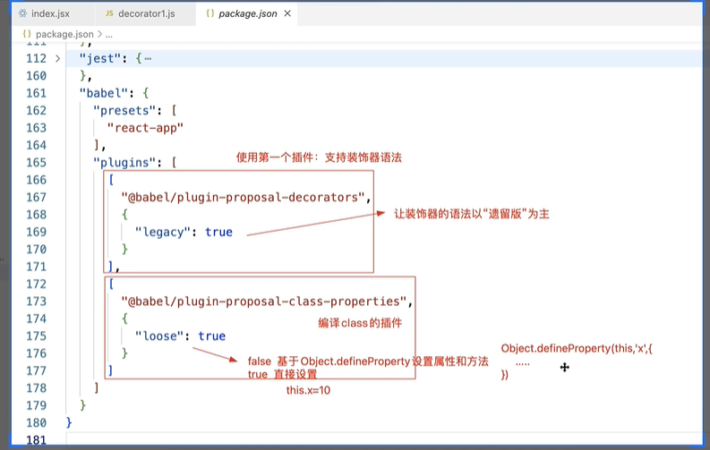
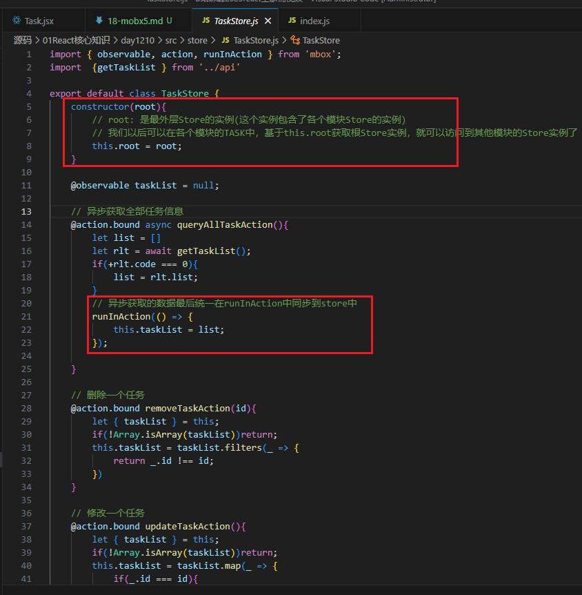
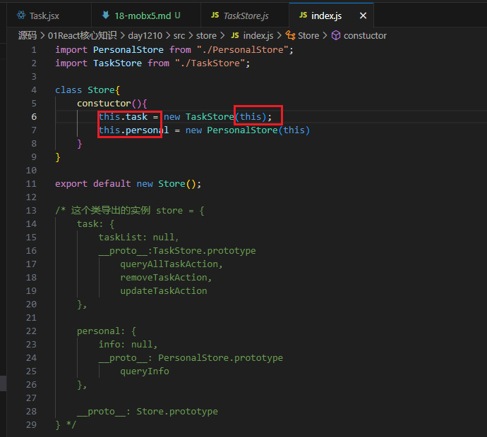
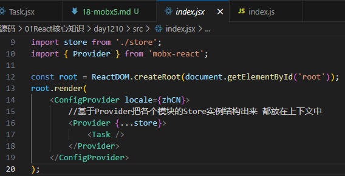
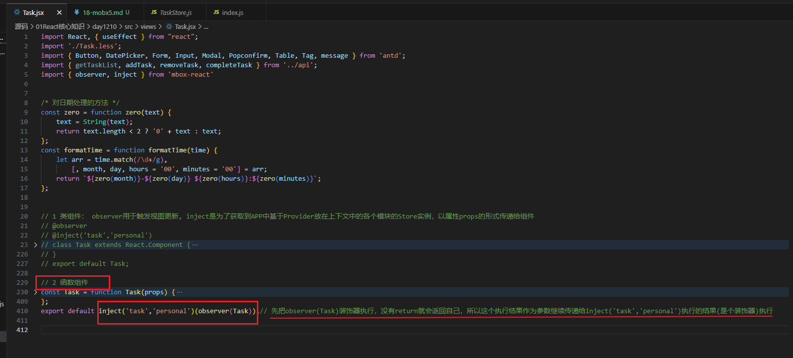
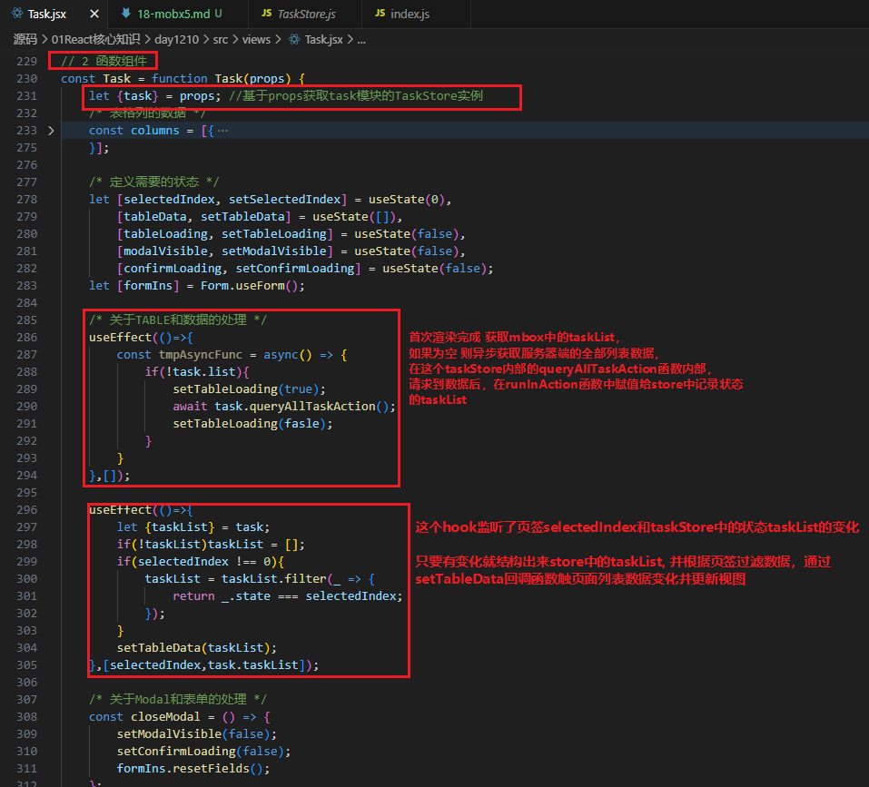
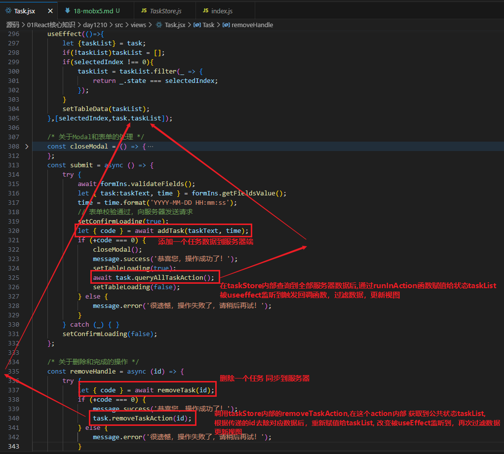
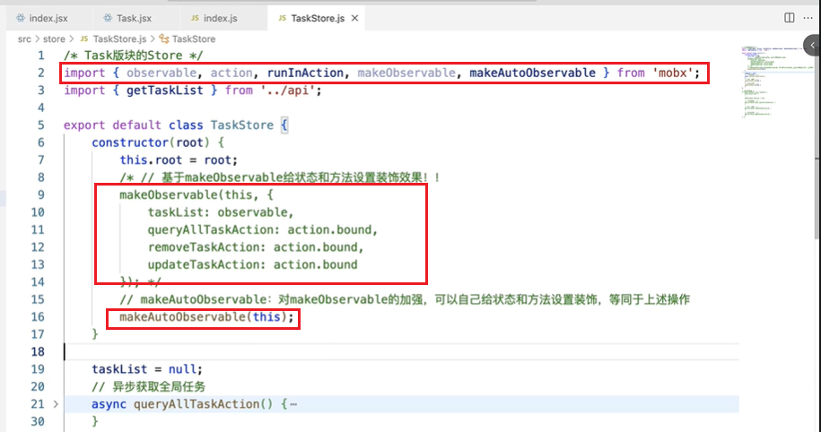

1. mbox: 状态管理库
    - mbox5: 5及以上版本运行在支持ES6 P  roxy的浏览器  ->  安装包`mbox`5 和 `mbox`6
    - mbox4: 运行在ES5的浏览器，跟5的API相同          -> 安装包`mbox`6 和 `mbox`7
    - mbox6: 移除了装饰器的操作(装饰器不是JS标准规范)
2. mbox5
    1. 想要使用mbox5, 需要让项目支持JS装饰器语法
        - 安装`mbox`5 和 `mbox`6
        - 安装`@babel/plugin-proposal-decorators`和`@babel/plugin-proposal-class-properties`
        - package.json中的babel的plugins需要添加配置
            
    2. 使用mbox导出的`@observable @action`和mobx-react导出的` @observer`作为装饰器函数实现公共状态管理
        - 使用示例：
            ```
            import React from 'react';
            import { observable, action } from 'mbox';
            import { observer } from 'mbox-react';

            //创建一个公共状态容器
            class Store {
                @observable
                num=10;

                @action
                change(){
                    this.num++;
                }
            }

            let store = new Store();

            
            // 类组件使用observer:直接给类组件添加一个装饰器(就是从mbox-react中导出的observer)
            @observer
            class Demo extends React.Component{

                render(){
                    <div>
                        <span>{ store.num }</span>
                        <button onclick = {() => { store.change(); }} >按钮</button>
                    </div>
                }
            }

            // 函数组件使用observer: 因为装饰器只能应用在类/类属性/类方法上，所以函数组件需要手动执行一下observer方法，并把整个组件当做参数传进去，达到和装饰器一样的效果
            const Demo = observer(function Demo(){
                return <div>
                        <span>{ store.num }</span>
                        <button onclick = {() => { store.change(); }} >按钮</button>
                    </div>;
                
            });

            // observer能够监测当前状态改变，并更新组件、视图
            export default Demo;
            ```

        - `autorun` 和 `reaction`
            - autorun是监听器,首先会立即执行一次，自动建立起依赖监测，当依赖的状态值改变，callback会重新执行
            - reaction也是监听器，提供更细粒化的状态监测(默认不会执行),需要手动设定需要监听的值，没有autorun那样的首次立即执行一次
            
            ```
            class Store {
                @observable   // 这里必须添加@observable：把状态变成可检测的，只有这样后续autorun/@observer等检测机制才会生效
                num=10; 
            }
            let store = new Store();

            autorun(() => {
                // autorun首先会立即执行一次，自动建立起依赖监测，当依赖的状态值改变，callback会重新执行
                console.log('autorun', store.x);
            });

            reaction(
                () => [store.x, store.total],
                () => {
                    console.log('reaction', store.x, store,total)
                }
            );//第一个参数指定依赖项，第二个参数是依赖改变后的回调

            setTimeout(()=>{
                store.x ++;
            }, 1000);
            ```
        - 经过`observable`修饰后的数据，是一个ES6 `proxy`对象，做了数据劫持的，observable无法直接装饰原始值，需要使用`observable.box`处理
        - 利用`observe`创建监听器，对对象进行监听，当对象中的某个成员发生改变，触发回调函数执行(前提是，对象是基于observable修饰过的，变成可监听的了)
            ```
            // 监听对象
            let obj = observable({
                x:10,
                y:20
            })

            observer(obj, change=>{
                console.log(change); 
            })
            obj.x = 1000; // 打印出 {type:'update',name:'x', oldValue:10,newValue:1000...}
            ```
            ```
            // 监听原始值
            let x = observable.box(10);
            console.log(x); // ObservableValue对象
            console.log(x.get()); // 10
            observe(x, change=>{
                console.log(change)
            });
            x。set(1000); // 打印出 {type:'update',name:'x', oldValue:10,newValue:1000...}
            ```
        - `computed`装饰器：创建一个具备计算缓存的计算属性
            ```
            class Store {
                @observable x = 10;
                @observable count = 3;
                @observable price = 120;
                @computed get total(){
                    console.log('total run');
                    return this.count * this.price;
                }
            }
            let store = new Store();

            autorun(()=>{
                console.log('autorun',store.x, store.total);
            })

            setTimeout(()=>{
                store.x = 1000; //1秒后会执行autorun，打印 autorun 1000 360  =>total属性不会重新执行，用之前缓存的结果
            },1000);

            setTimeout(()=>{
                store.count = 10; //2秒后会执行autorun，打印 autorun 1000 1200 => total计算属性要重新执行，计算出新值
            },2000);
            ```
        - `action`装饰器
            - `action.bound`:不管外部怎么调用action修饰的函数，都可以保证这个函数中的this都是store实例
            ```
            class Store {
                @observable x = 10;
                @observable y = 20;
                @action change(){
                    // action装饰器的执行，让函数中的状态更改变成`异步批处理`，真实项目中状态值的修改都建议使用action这种方式
                    this.x = 1000；
                    this.y = 2000;
                }
                @action.bound change2(){
                    this.x = 1000;
                    this.y = 2000;
                }
            }
            let store = new Store();

            autorun(()=>{
                console.log('autorun', store.x, store.y);
            });

            setTimeout(()=>{
                // 1秒后会触发上面的autorun执行2次，分别改变x,y, 正常不希望是异步的执行两次，所以需要嗲用action，在action里面去修改store值
                store.x = 1000; 
                store.y = 2000;

            },1000);

            setTimeout(()=>{
                // 2秒后会触发上面的autorun执行1次
                store.change();

            },2000);

            setTimeout(()=>{
                // 3秒后会触发上面的autorun执行1次
                // store.change2(); // 这种调用方式，change2中的this是store
                let func = store.change2;
                func(); // change2定义的时候装饰器没有设置bound的话，change2中的this是undefined, 设置了bound后change2中的this才会是store

            },3000);

            ```
        - `runInAction`等同于action,可以在store外部将同时修改多个store属性状态值的操作变成同步的
            ```
            setTimeout(()=>{
               runInAction(()=>{
                    store.x = 1000; 
                    store.y = 2000;
               });
            },1000);
            ```
    3. mobx全局配置`configure`
        ```
        import {configure} from 'mbox';
        configure({
            enforceActions:'observed', //强制使用actions修改状态值，不能在外面直接调用store.xx=xx修改
        });
        ```
    4. 实现异步派发
        ```
        class Store {
            @observable x = 10;
            @action.bound async change(){
                let res = await http.queryNum();//假设返回1000

                // 需要在异步结束后，基于runInAction去修改状态
                runInAction(()=>{
                    this.x = res;
                })
            }
        }
        let store = new Store();
        
        autorun(()={
            console.log('autorun',store.x); //首次默认执行打印autorun 10, 下面调用change方法后打印autorun 1000
        });

        store.change();
        ```
    5. 基于mbox5实战
        - 参见day1210下面的src代码
        - 创建各个模块自己的Store, 需要在构造函数中接收传递进来的根Store实例 比如 day1210\src\store\TaskStore.js
            
        - 在根Store文件中，实例化各个模块自己的Store,然后把跟Store实例传递给各个模块自己的Store
            
        - 在APP中，基于mbox-react中导出的Provider组件，把根Store实例结构传递给全局上下文中
            
        - mbox在类组件中的使用
            
        - mbox在函数组件中的使用
            
            
            
3. mbox6
    1. 安装包`mbox`6 和 `mbox`7
        - 因为mbox6去除了装饰器
        - 不用安装安装`@babel/plugin-proposal-decorators`和`@babel/plugin-proposal-class-properties`
        - package.json中的babel的plugins也不需要添加上述配置
    2. 基于`makeObservable`和`makeAutoObservable`
        - 相对于mbox5, 只需要去除装饰器@xxx的写法就行了，类组件中应该不行，改用函数组件
            