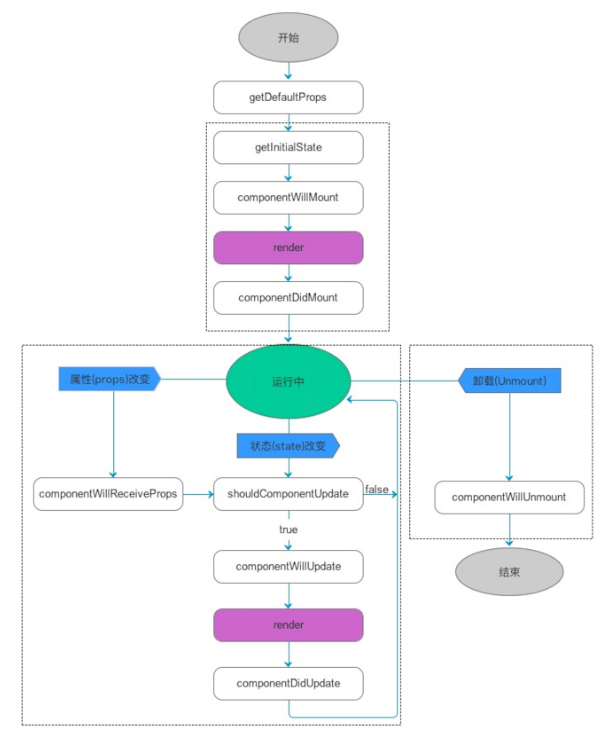

1. 循环相关知识
    - for-in循环：性能较差，既可以迭代私有的，也可以迭代公有的；且只能迭代可枚举的、非symbol类型的属性。。。
    - 获取对象所有私有属性（私有的，不论是否可枚举，不论类型）
        - Object.getOwnPropertyNames：获取对象非symbol类型的私有属性（无论是否可枚举）
        - Object.getOwnPropewrtySymbols: 获取对象Symbol类型的私有属性
        - 综上，获取对象所有私有属性ley keys = Obejct.getOwnPropertyNames(arr).concat(Object.getOwnProertySymbols(arr))
    - 基于es6中的Reflect.OwnKeys，缺点是不兼容IE
        - ley keys = Reflect.ownKeys(arr)

2. jsx底层渲染机制
    1. 把jsx通过babel-preset-react-app插件编译成虚拟dom
        - 通过babel-preset-react-app把jsx编译成`React.crateElement(type, props, children)`这种***格式***
        - 再通过执行`React.crateElement(type, props, children)`这个方法得到虚拟dom
            ```
            virtualDOM = {
                $$typeof: Symbol(react.element),
                ref: null,
                key: null,
                type: 标签名「或组件」,
                // 存储了元素的相关属性 && 子节点信息
                props: {
                    元素的相关属性,
                    children:子节点信息「没有子节点则没有这个属性、属性值可能是一个值、也可能是一个数组」
                }
            }
            ```
    2. 通过React.render()把虚拟dom渲染成真实DOM
        - v16:
        ```
        React.render(组件，挂载节点)
        ```
        - v18:
        ```
        let root = React.createDom(Document.getElementById('#root'));
        root.render(组件)
        ```
        - 第一渲染的时候是把整个虚拟dom全部渲染到屏幕上， 后面的改动都是先计算出两次虚拟dom之间的差异patch, 只对差异部分进行渲染

3. react的插槽
    通过双闭合标签的形式调用组件，在闭合符号之间添加DOM模拟插槽，以达到组件的高复用性
    - 在被调用的组件内部，props是被冻结的，可以结构出来children属性， 这个children属性就包含了调用组件时候在双闭合标签内传递进来的DOM
    - 在被调用的组件内部，使用插槽的时候， 需要借助`React.Children.toArray/count/foreach... `等方法进行处理并赋值给新的变量，后续就可以使用这个新的变量， 因为props结构出来的children有可能是undefiend, 有可能就是一个虚拟DOM, 有可能是一个虚拟dom数组
    ```
        // 实现
        const DemoOne = function DemoOne(props){
            // 注意： 传递进来的children都是编译后的虚拟DOM，而不是传递的标签DOM
            const {title, style, className, children} = props;
            ....
            ....
            // 用法1
            const newChildren = React.Children.toArray(children);

            // 用法2
            const headers = [];
            const footers = [];
            const others = [];
            React.Children.forEach(childVDom => {
                const {slot} = childVDom.props；
                if(slot === 'header'){
                    headers.push(childVDom);
                }else if(slot === 'footer'){
                    footers.push(childVDom);
                }else{
                    others.push(childVDom);
                }
            })
            ....
            return <>
                {headers}

                {newChildren[0]}

                <h2>啊哈哈哈哈哈</h2>
                ...

                {newChildren[1]}

                {footers}
            </>;
        }
        export default DemoOne;
    ```
    ```
    // 调用
        React.render(
            <>
                <DemoOne title='第一段' className='firstP'>
                    <span slot='footer'>我是页脚</span> // slot字段是给传递的插槽信息设置名字， 这个名字可以是任意的， 具名插槽可以在调用的时候不用考虑顺序，设置好对应的名字就行， 在实现插槽的组件内部可以任意使用
                    <span slot='header'>我是页眉</span>
                </DemoOne>
                
                <DemoOne title='第二段' className='secP'>
                    <span slot='other'>我是第二段</span>
                </DemoOne>

                <DemoOne title='第三段' className='thirdP'>
                </DemoOne>

            </>,
        root)
    ```
4. 可以通过设置组件的props的默认值和props的属性类型 进行规则校验
    - 进行规则校验前必须引入`import PropTypes from 'prop-types'`
    ```
    // props默认值
    DemoComponent.defaultProps = {
        title:'温馨提示'，
        num:1
        ...
    }
    ```
    ```
    // props属性类型约束
    DemoComponent.propTypes = {
        title: PropTypes.string,
        num: PropTypes.isOneOf([
            PropTypes.string.isRequired,
            PropTypes.number
        ])
    }
    ``` 
5. 类组件
    1. 创建一个构造函数
        - 必须继承React.Component/PureComponent
        - 给当前类设置一个render方法（是放在其原型上的）：在render方法中，返回需要渲染的视图
        - render方法在渲染的时候，如果type是
            - 字符串： 创建一个标签
            - 普通函数： 执行这个函数，并把props传递给函数
            - 构造函数：把构造函数基于new执行（创建一个类的实例），同时传递props
    2. 从调用类组件new DemoComponent({...})开始，类组件内部发生的事情：
        1. 初始化属性 & 设置规则校验(添加静态属性static defaultProps和static propTypes)
        2. 初始化状态
            - 状态： 后期修改状态， 可以触发试图的更新
            - 需要手动初始化，如果没有手动初始化， 会默认在实例上挂载一个state属性，初始值是null
            ```
            // 1. 可以直接添加属性
            state = {
                title: '你好哇'，
                id: 1
            }

            // 2. 或者在constructor函数中设置
                constructor(props){
                    super(props);
                    ...
                    this.state = {
                        title: '你好哇'，
                        id:1
                    }
                }
            ``` 
            - 修改状态， 更新视图
                - this.state.xxx = xxx 这种只能修改实例的state值， 并不能更新视图
                - 想要视图更新，我们需要基于`React.Component.prototype`提供的方法操作
                    - 第一种： `this.setState(partialState)`
                        - partialState: 部分状态
                        - this.setState({
                            xxx:xxxx
                        })
                    - 第二种： `this.forceUpdate()` 强制更新
    3. `类组件第一次渲染的底层逻辑`
        1. 触发`componentWillMount`周期钩子函数
            - 这个周期函数是不安全的，不建议使用
            - 目前可以使用， 但是控制台会抛出黄色警告
            - 不想要这个黄色警告的话， 可以暂时在这个钩子函数名称前面加上`UNSAFE_`
            - 但是如果开启了`React.StrictMode`模式，即便加了前缀控制台也会抛出红色错误
            - 这个`componentWillMount`会在第一次渲染之前执行（会在第一次执行render函数之前执行）
        2. 执行`render`周期函数, 进行渲染
        3. 执行`componentDidMount`周期函数
            - 第一次渲染完成，已经把virtualDOM变为真实DOM了，所以这个阶段可以获取到真实DOM了
    4. `组件更新的逻辑`:
        - 当在组件内部修改了组件状态state，组件会更新
            1. 触发`shouldComponentUpdate(nextProps, nextState)`周期函数
                - nextState存储要修改的最新状态， 此时this.state还是修改前的状态还没有改变
                - shouldComponentUpdate这个周期函数需要返回true/false
                    - true: 允许更新，会继续执行下一个操作
                    - false: 不允许更新， 接下来啥都不处理
            2. 触发`componentWillUpdate(nextProps， nextState)`
                - 这个阶段this.state也还没有被改变
            3. 修改this.state/属性值为最新的
            4. 触发render周期函数：组件更新
                - 按照最新的状态、属性值，把返回的JSX编译为virtualDOM
                - 把和上一次渲染出来的virtualDOM改进型对比DOM_DIFF
                - 把差异的部分进行渲染，渲染成真实的DOM
            5. 触发`componetDidUpdate`周期函数
        - 当父组件更新，触发了子组件的更新
            1. 触发子组件的`componentWillReceiveProps(nextProps)`
            2. 触发`shouldComponentWillUpdate`
            3. 触发`componentWillUpdate`
            4. 修改状态state/属性值
            4. 触发`render`
            4. 触发`componentDidUpdate`
        - 特殊说明：如果是基于`this.forceUpdate()`进行强制视图更新，会**跳过shouldComponetUpdate**周期函数的校验， 直接从**componentWillUpdate**开始进行更新，也就是说一定会进行视图更新
        - `深度优先原则`：父组件在操作中，遇到子组件，一定是把子组件操作完毕，才会继续父组件的后续操作
            - 父组件第一次渲染：
                - 父willmount  -->
                - 父render  -->
                    - 子willmount -> 子render -> 子didmount
                - 父didmount
            - 父组件更新
                - 父shouldUpdate  -->
                - 父willUpdate  -->
                - 父render  -->
                    - 子willReceiveProps -> 子shouldUpdate -> 子willUpdate -> 子render -> 子didUpdate
                - 父didUpdate
    5. react生命周期
        
    
                    

                    

