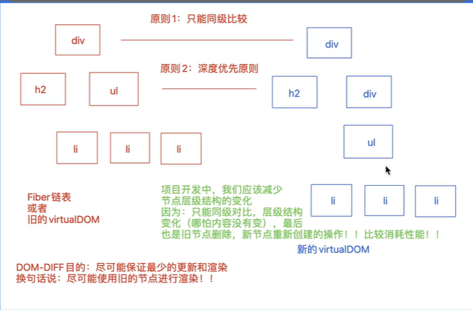

1. jsx或者说react的渲染机制:
    - 1. 把jsx语法编译为虚拟DOMvirtualDOM
        - 1.1 基于`babel-preset-react-app`把jsx视图编译为`React.createElement(标签名/组件名, props, ...childrfen)`格式
        - 1.2 执行React.createElement(标签名/组件名, props, ...childrfen)得到对应的`virtualDOM`
    - 2. 基于ReactDOM中的render方法,把virtualDOM编译为真实DOM,交给浏览器渲染
    - 3. 组件更新的时候:
        - 3.1. 会根据最新的数据, `重新把整个jsx编译为最新的virtualDOM`(不论有的地方数据是否触发改变,virtualDOM都是从头编译到尾的)
        - 3.2. 但是不会把整个新的virtualDOM全部编译为真实DOM, 需要经过过一个``DOM-DIFF`的对比, 把virtualDOM中的差异部分获取到, 接下来只把差异的部分渲染为真实的DOM,交给浏览器渲染
2. DOM-DIFF:主要就是在组件更新的时候,可以差异化的更新,而不是整体更新,以此来优化组件渲染的速度,提高性能
    - React16及以前: 新老virtualDOM对比
    - React17及以后: `老的DOM会构建出Filber链表,拿最新创建的virtualDOM和Filber链表做对比`
3. 优化原则
    - 深度优先
    - 同级对比
    - 不同标签的元素,会产生不同的结构: 那就销毁老的结构, 创建新结构
    - 可以通过key标识移动的元素: 如果不设置key,默认索引就是key  --> 循环动态绑定的元素一定要设置key
4. 处理原则:
    - 1. 处理原则
        -  key和标签都相同
            - 更新且复用老的节点 Update(4)
        - key和标签只要有一个不同
            - 删除老的节点 Deletion(8)
            - 插入新增新的节点 Placement(2)
        - 插入并更新, 也就是挪动位置 PlacementAndUpdate(6)
        - key 标签 内容全部都一样, 直接复用旧的节点,不做任何处理
    - 2. 详细的处理步骤
        - 可能会经理二轮遍历
            - 第一轮:主要是处理节点的更新
            - 第二轮:主要是处理节点的新增,删除,移动
        - key不同跳出第一轮循环, 开始第二轮(遍历新的virtualDOM节点, 处理过的跳过, 没有处理过的根据key去老的DOM对应的Filber链表中查找相同key的节点,找到了,先按照标签再按照内容对比,进行标记是新增2,或是插入并更新6,或是删除8)
        - 移动时的原则是尽量少量的移动,如果必须有一个要动,新地位高的不动,新地位低的动 `lastPlacedIndex`
        - 最后按照`8-4-6-2`的顺序处理,得到最终的节点顺序
        - 
        - 
        - 
    - 尽量不要用索引做key
        - 因为如果用索引做key,会造成一些只是位置挪动/新增节点/删除节点的情况,不能实现`就地复用`,因为key全变了,基本上都是用新的内容来替换老的内容(dom-diff第一轮都是先遍历旧节点的filber链表,按照位置找到新virtualDOM中的相同位置节点,紧接着就是按照key做比较,key相同再比较标签和内容,有不同就标记为update(4),key不相同,跳出第一轮循环,开启第二轮,遍历新的virtualDOM,根据未处理的节点的key找到旧节点中相同key的节点,再比较标签和内容,再依次打标8/2/6)
        
    - 所以,我们应该用不会因位置变化而变化的值作为key