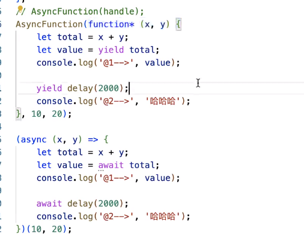

1. 创建一个Generator生成器函数:
    - 创建函数的function后面紧接着添加*, 如果是对象属性作为一个迭代器函数,就把这个属性前面加个*
    - 箭头函数是无法变为生成器函数的
2. 每一个生成器函数,都是GeneratorFuntion这个类的实例
    - 生成器函数的原型链 : generatorFn.__proto__ --> GenaratorFunction.__proto__ --> Function.protoType
    - 普通函数的原型链: fn.__proto__ --> Function.protoType
3. 当执行生成器函数:
    - 首先,不会立即把生成器函数的函数体中的代码执行
    - 而是,返回一个具备迭代器规范的对象itor, 这个itor具有:
        - itor.next()  --> {done: true/false, value:xxx}
        - itor.throw()
        - itor.return()
        - itor[Symbol(Symbol.iteator)]: function (){ ...}
        - ...
        ```
        const fn = function* (){
            return 100;
        }

        let itor = fn();
        console.log(itor.next()) // {done:true, value:100}
        console.log(itor.next()) // {done:true, value:undefined}
        ```
4. Generator生成器函数的作用:
    - 可以基于返回的itor(迭代器对象),基于next方法, 控制函数体中的代码,一步步的去执行
    - 每一次执行next, 控制函数体中的代码执行, 直到遇到yeild则暂停执行下面的代码,等待下一个next被调用,然后从上一次暂停的位置开始执行
        - itor.next() // {done:true/false, value: yeild后面的值}
    - 直到遇到函数体的return或者已经执行到函数最末尾的位置了, 返回 {done:true, value: 函数返回值或者undefined}
    ```
    // 1. 生成器函数和yeild执行流程
    const fn = function* () {
        console.log('a');
        yeild 1;
        
        console.log('b');
        yeild 2;

        console.log('c');
        yeild 3;
    }

    let itor = fn();
    console.log(itor.next()); // {done:false, value: 1}
    console.log(itor.next()); // {done:false, value: 2}
    console.log(itor.next()); // {done:false, value: 3}
    console.log(itor.next()); // {done:true, value: undefined}
    ```

    ```
    // 2. itor.throw('哈哈哈') 手动抛出异常,终止包括生成器函数在内的一切后续执行
    const fn = function* () {
        console.log('a');
        yeild 1;
        
        console.log('b');
        yeild 2;

        console.log('c');
        yeild 3;
    }

    let itor = fn();
    console.log(itor.next()); // {done:false, value: 1}
    console.log(itor.throw); // 手动抛出异常,控制台报错, 生成器函数中的代码,都不会再执行了
    console.log(itor.next()); // 不再执行, 没有任何打印内容
    console.log('我是外边的代码,位置在throw后面') // 即便不是调用生成器函数的东西, 也不再执行了, 控制台没有任何打印内容
    ```

    ```
    // 3. itor.return('xxx'), 结束生成器函数体的继续执行done:true, 返回值xxx赋值给value
    const fn = function* () {
        console.log('a');
        yeild 1;
        
        console.log('b');
        yeild 2;

        console.log('c');
        yeild 3;
    }

    let itor = fn();
    console.log(itor.next()); // {done:false, value: 1}
    console.log(itor.return('哈哈哈')); // {done:true, value: '哈哈哈'} 结束整个函数体的继续执行done:true, 返回值赋值给value
    console.log(itor.next()); // {done:true, value: undefined}
    ```

    ```
    // 4. 生成器函数的函数体执行时机
    const fn = function* (x) {
        console.log(100)
        yeild 1;
        yeild 2;
    }

    let itor = fn(); // 执行这一行后, fn内部不会被执行,所以100不会被打印, 只能执行itor的next()方法才会走进fn函数体内部
    // console.log(itor.next('first: 111'));
    ```

    ```
    // 5. 生成器函数传参: itor.next(N): 每一次执行next方法, next方法传递的值会作为上一个yeild的返回值. (所以,第一次执行next方法传递的值是没有用的,因为在它之前没有yeild)
    const fn = function* (...params) {
        // ...params: [10, 20, 30]
        let x = yeild 1;
        console.log(x); // 'second: 222'

        let y = yeild 2;
        console.log(y)  // 'third: 333'
    }

    let itor = fn(10, 20, 30);
    // console.log(itor.next('first: 111')); // {done: false, value:1}
    // console.log(itor.next('second: 222')); // {done: false, value:2},生成器函数体内的console.log(x);被执行,x值就是'second: 222',被打印出来
    // console.log(itor.next('third: 333')); // {done:true, value:undefined},生成器函数体内的console.log(y)被执行,y值就是'third: 333',被打印出来
    ```

    ```
    // 6.1 生成器函数嵌套
    const sum = function* (){
        yeild 3;
        yeild 4;
    }
    const fn = function* (x) {
        let x = yeild 1;

        sum();

        let y = yeild 2;
    }

    let itor = fn(10, 20, 30);
    console.log(itor.next()) // {done:false, value 1}
    console.log(itor.next()) // {done:false, value 2}
    console.log(itor.next()) // {done:true, value undefined}
    ```

    ```
    // 6.2 生成器函数嵌套 - 等待嵌套函数执行完毕
    const sum = function* (){
        yeild 3;
        yeild 4;
    }
    const fn = function* (x) {
        let x = yeild 1;

        yeild* sum(); // yeild后面带上*: 支持进入另一个生成器函数内部中去一步步执行, 不带*: 会当做普通函数,返回{done:false, value: sum函数}

        let y = yeild 2;
    }

    let itor = fn(10, 20, 30);
    console.log(itor.next()) // {done:false, value:1}
    console.log(itor.next()) // {done:false, value:3}
    console.log(itor.next()) // {done:false, value:4}
    console.log(itor.next()) // {done:false, value:2}
    console.log(itor.next()) // {done:true, value:undefined}
    ```

    ```
    // 7. 串行请求: 有三个请求,请求时间分别是1000,2000,3000
    const delay = (delay=1000){
        return new Promise(resolve => {
            setTimeout(() => {
                resolve(`@@${interval}`)
            }, interval)
        });
    }
    // 第一种方式:
    delay(1000)
    .then(value=>{
        console.log('第一个请求成功', value);
        return delay(2000);
    })
    .then(val=>{
        console.log('第二个请求成功', value);
        return delay(3000);
    })
    .then(val=>{
        console.log('第三个请求成功', value);
    })
    .cache(reason=>{
        console.log('任何请求失败走这里',reason);
    });

    // 第二种方式:
    async ()=> {
        try{
            let value = await dealy(1000);
            console.log('第一个请求成功', value);

            let value = await dealy(2000);
            console.log('第二个请求成功', value);

            let value = await dealy(3000);
            console.log('第三个请求成功', value);
        }cache(reason){
            console.log('任何请求失败走这里',reason);
        }
    }();

    //第三种方式: 基于generator生成器函数, 模拟await的语法, 实现请求的串行
    const handle = function* handle(){
            let first = yeild dealy(1000);
            console.log('第一个请求成功', first);

            let second = yeild dealy(2000);
            console.log('第二个请求成功', second);

            let third = yeild dealy(3000);
            console.log('第三个请求成功', third);
    }

    let itor = handle();
    // done:是否执行完毕, value: 获取的是每一个yeild后面的值(这里是一个promise实例)
    let {done, value} = itor.next();
    value.then(val=>{
        // val是第一次请求返回的结果 @@1000
        let {done, value} = itor.next(val);// itor.next(val)执行,是把@@:1000当做参数传递给第一次yeild执行完的结果first, 所以会在控制台打印'第一个请求成功 @@1000'
        value.then(val=>{
            // val是第二次请求返回的结果 @@2000
             let {done, value} = itor.next(val);
             value.then(val=>{
                // val是第三次请求返回的结果 @@3000
                let {done, value} = itor.next(val);
             })
        })
    })

    // 第四种方式: 用递归的方式 改写一下方式三  --> async/await的原理
    const handle = function* handle(){
            let first = yeild dealy(1000);
            console.log('第一个请求成功', first);

            let second = yeild dealy(2000);
            console.log('第二个请求成功', second);

            let third = yeild dealy(3000);
            console.log('第三个请求成功', third);
    }
    const AsyncFunction  = function AsyncFunction(...params){
        let itor = handle(...params);
        const next = x => {
            let {done, value} = itor.next(x);
            if(done){
                return;
            }
            if(!(value instanceof Promise)){
                value = Promise.resolve(value);
            }
            <!-- 
            value.then(x => {
                next(x);
            })
             -->
            value.then(next);
        }
        next();
    }
    ```

5. ES8(ECMAScript2017)中, 提供了async/await语法: 用来简化promise操作
    - 他是promise + generator的语法糖
    - 上面我们自己实现的`AsyncFunction`和Generator函数handle就是`async/await的语法糖`
    ```
    // 参数generator: 想要处理的生成器函数
    const AsyncFunction  = function AsyncFunction(generator, ...params){
        let itor = generator(...params);
        // 基于递归的方法, 通知generator函数中的代码逐一执行
        const next = x => {
            let {done, value} = itor.next(x);
            if(done){
                return;
            }
            if(!(value instanceof Promise)){
                value = Promise.resolve(value);
            }
            value.then(next);
        };
        next();
    }
    ```
    
    - `co.js`这个库在Node中使用, 可以在node环境下,实现出类似于async/await的效果
