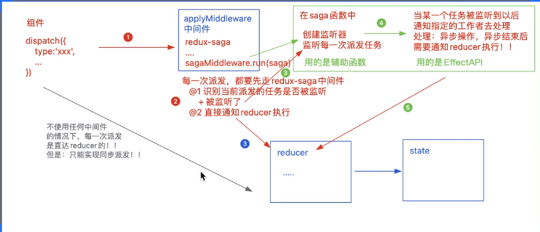
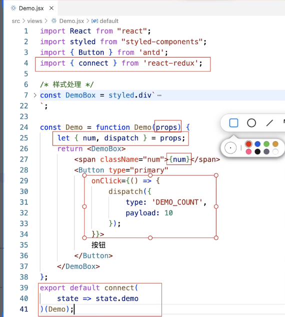
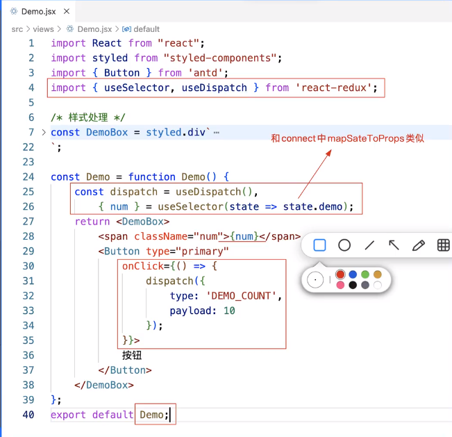

1. redux-saga是一个用于管理`异步获取数据(副作用)`的redux中间件,它的目标是让副作用管理更容易,执行更高效,测试更简单,处理故障更容易
2. redux-thunk和redux-saga比较
    - redux中的数据流: action --> reducer --> state
        - action: 是一个纯粹的对象(plain object)
        - reducer: 是一个纯函数
        - 都只能处理同步的操作
    - redux-thunk中间件的处理:
        - action1 --> middleware --> action2 --> reducer --> state
            - 中间件处理: 两次派发: 在原来的action派发后到达reducer之前, 通过中间件处理完后, 再次派发
        - redux-thunk虽然可以实现异步派发,但也有弊端: 异步操作分散到每一个actionCreator中,而且返回函数中的代码具备多样性,不能集中/统一的方式进行管理, 也不方便做单元测试
        ```
        // action中的同步操作
        supportActionSync(){
            return {
                type: TYPES.VOTE_SUP;
            }
        }

        // action中的异步操作 - 使用redux-thunk
        supportActionAsync(){
            return async dispatch => {
                await dealy();
                dispatch({
                    type: TYPES.VOTE_SUP;
                });
            };
        }

        // action中的异步操作 - 使用redux-promise
        async upportActionAsync(){
            await dealy();
           return {
                type: TYPES.VOTE_SUP;
            };
        }
        ```
3. redux-saga中间件的流程:
    - redux-saga提供了一些列的api,可以去监听纯粹对象格式的action,方便单元测试
    - action1 --> redux-saga监听 --> 执行redux-saga提供的API方法 --> 返回描述对象 --> 执行异步操作 --> action2 --> reducer --> state
    
4. 注意点:
    - 在组件中基于dispatch派发的时候, 派发的action对象中的type属性(派发的行为标识),他的命名细节有个注意点
        - 因为: 每一次派发,一定会把reducer执行一边, 再去saga中,判断是否被监听
        - 如果进行`同步派发`:
            - 则我们派发的行为标识需要和reducer中做判断的行为标识保持一致
            - 并且在saga中,不需要在对这个标识做监听了
            - 同步的派发操作的标识,我们可以在`@/store/action-types.js`中统一管理
        - 如果进行`异步派发`:
            - 我们派发的标识, **一定不能和reducer中做判断的标识一样**
            - 需要在saga中对这个标识进行监听, 监听到派发后,进行异步操作处理
            - 我们可以在正常的标识后面添加一些自定义规范来做区别,比如在正常的标识后面添加'@SAGA@'
            - **当异步操作结束后,我们基于yield put 进行派发的时候,设置的派发标识,要和reducer中做判断的标识一样**
4. redux-saga使用流程:
    - 安装`redux-saga`包
        ```
        // 第1步. 在@/store/index.js中导入redux-sage并解构出`createSagaMiddleware`函数,执行这个函数,并调用run(saga)启动
        import { createStore, applyMiddleware } from 'redux';
        import createSagaMiddleware from 'redux-saga';
        import reducer from './reducer';
        import saga from './saga';

        // sagaMiddleware
        const sagaMiddleware = createSagaMiddleware();

        // 创建store容器
        const store = createStore(
            reducer,
            applyMiddleware(sagamiddleware)
        )

        // 启动saga: 在应用中间件后,基于run方法,执行saga这个生成器函数,目的: 创建任务的监听
        sagaMiddleware.run(saga);

        export default store;
        ```
        
        ```
        // 第2步. 在@/store/saga.js中编写saga生成器函数
            // 创建监听器, 监听派发的任务
        import { take, takeEvery,takeLatest, throttle, debounce, call, apply, fork, delay, put } from 'redux-saga/effects';

        // 创建执行函数, 在任务被监听后,去做异步操作 -> generator函数
        const workingCount = function* workingCount(action){
            // action: 组件中派发时候传递的action对象
            yield delay(2000); // 使用redux-saga/effects导出的delay延迟2S, 模拟想服务器发送请求
            // 派发任务,通知reducer执行
            yield put{{
                type: 'DEMO_COUNT', // 这里派发的行为标识不带自定义的部分,因为需要被reducer中的行为标识匹配到才可以
                payload: action.payload
            }}
        }

        // 创建监听器, 监听派发的任务 -> generator函数
        const saga = function* saga(){

            <!--  take: 监听一次的用法
            let action = yield take('DEMO_COUNT' + '@SAGA@'); //注意监听的这个行为标识名称; take的监听只会执行一次
            yield workingCount(action);
             -->

            yield takeEvery('DEMO_COUNT' + '@SAGA@', workingCount); // takeEvery实现一直监听
        };
        export default saga;
        ```

        ```
        //  第3步: 组件中的处理
        // 3.1. redux-saga处理方式1:
            // 不用单独添加action文件了, action直接写在自己的组件里面
        import { connect } from 'react-redux'
        const Demo = function Demo(props){
            let {num, dispatch} = props;

            return <>
                <span>{num}</span>
                <button onClick={ () => {
                    dispatch{
                        type:'DEMO_COUNT',
                        payload: 5
                    }
                }}>同步按钮</button>
                <button onClick={ () => {
                    dispatch{
                        type:'DEMO_COUNT' + '@SAGA@', //注意派发的这个异步行为标识名称
                        payload: 10
                    }
                }}>异步按钮</button>
            </>
        }
        export default connect(
            state => state.demo,
            <!-- connect的第二个参数可以不用传, 不传递的情况下,默认把dispatch传递给组件 
            dispatch => {
                return {
                    dispatch
                }
            } -->
        )(Demo)
        ```
        

        ```
        // 3.2. redux-saga处理方式2:
            // 不用单独添加action文件了, action直接写在自己的组件里面
            // 也不用使用connect高阶函数了,state和action直接使用hook函数useSelctor useDispatch获取
        import { useSelector, useDispatch } from 'react-redux'
        const Demo = function Demo(props){
            <!-- let {num, dispatch} = props; -->
        
            let dispatch = useDispatch();
            let { num } = useSelctor(state => state.demo)

            return <>
                <span>{num}</span>
                <button onClick={ () => {
                    dispatch{
                        type:'DEMO_COUNT',
                        payload: 5
                    }
                }}>同步按钮</button>
                <button onClick={ () => {
                    dispatch{
                        type:'DEMO_COUNT' + '@SAGA@',
                        payload: 10
                    }
                }}>异步按钮</button>
            </>
        }
        export default Demo;
        ```
        