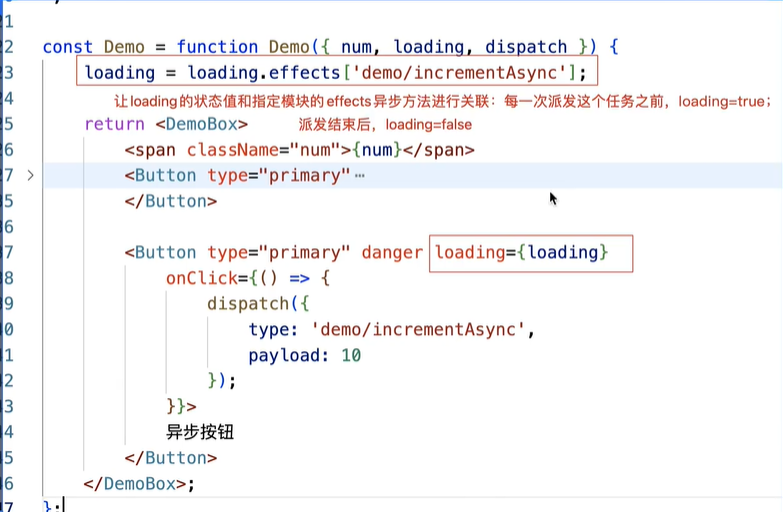

0. 源码在react18全家桶-全套课程讲义\03淘系方案\day1231 (或者:followcoding\源码\day1231)
1. 
    - 每一个state都具有这五块:
        - namespace: 模块名, 后期获取状态和进行派发时候的标识
        - state: 此模块管理的公共状态
        - reducers: 以一个个方法的形式,完成派发标识的判断和状态的修改
        - effects: 基于redux-saga实现异步操作,异步派发
        - subscriptions: 在这里订阅的方法,会在页面一加载的时候就被通知执行,所以我们可以把页面一加载就要做的事情在这里处理,比如可以基于history.listen做事件侦听,保证进入哪个组件后在处理
    - 在组件中, 可以基于dva提供的connect高阶函数,使用公共状态和dispatch方法
        ```
        import React from "react";
        import styled from "styled-components";
        import { connect } from 'dva'
        import { Button } from 'antd';
        ...
        const Demo = function Demo(props) {
            let { num, dispatch } = props; // 从props中获取到dispatch
            return <DemoBox>
                <span className="num">{num}</span>
                <Button type="primary"
                    onClick={() => {
                        dispatch({
                            type: "demo/increment",
                            payload: 5
                        });
                    }}>
                    按钮
                </Button>
                <Button type="primary" danger
                    onClick={() => {
                        dispatch({
                            type: 'demo/incrementAsync',
                            payload: 10
                        });
                    }}>
                    异步按钮
                </Button>
            </DemoBox>;
        };
        export default connect(state => state.demo)(Demo);//connect第二个参数没有则默认传递dispatch
        ```
    - `路由懒加载`使用dva提供的`dynamic`方法, 传入app,models,component即可
        ```
        // 路由懒加载 封装一下
        const lazy = function lazy(component, models) {
            if (typeof models === "undefined") models = () => [];
            return dynamic({
                app: window.app,
                models,
                component
            });
        };
        ```
    - 组件中进行派发的时候,要加上模块名
        ```
        // 组件中派发
        <button onClick={ ()=> { 
            dispatch({
                type: 'demo/increcement', // demo是模块名, 派发时候要加上
                payload: 5
            });
        }} >增加</button>

        // state中处理
        namespace:'demo',
        reducers: {
            increcement(state, {payload}){
                return {
                    ... state,
                    num: state.num + payload
                }
            }
        }
        ```
    - 异步派发后对应的处理方法(也就是redux-saga中监听的是事件)在effects中实现, 一般函数名都加一个'async'做区分, 并且函数是一个Generator函数,要加*号
        - effects中的generator函数, 默认都是基于takeEvery方式创建的监听器, 如果想设置不同类型的监听器, 则需要写成数组形式
        ```
        namespace:'demo',
        effects: {
            
            // action: 组建中派发时候传递的action对象
            // effect: 是saga中提供的effectAPI, 但是没有delay/debounce等. 
                // 其中select可以获取所有模块的公共状态(let allState = yield select())
                // let demoState = yiled select(state=>state.demo) 获取指定模块的状态
            *increcementAsync({payload}, {call, put, select}){
                yield call(delayFun, 1000);
                yield put({
                    type: 'increcement',
                    payload
                })
            },

            // 指定监听器类型的写法:
            incrementAsync: [
                function* ({payload}, {call, put}){
                    yield call(delayFun, 1000);
                    yield put({
                        type: 'increcement',
                        payload
                    });
                },
                <!-- {type: 'takeLatest'} -->
                {type: 'throttle', ms:500}
            ],
        }
        ```
    - subscriptions
        - subscriptions中写的方法,在任意页面一加载的时候,就会把所有对应model不是懒加载的页面中设定的方法执行
            - 在浏览器地址指定某个页面地址后打开页面, 所有的页面(对应的model没有懒加载!!!)写的subscriptions中的函数都会被执行 !
            - 方法只有在页面一加载的时候,订阅执行一次,在后期路由切换的时候,不再执行!
            - 可以借助`history.listen((location)=>{location.pathname...})`实现路由跳转监听,只要**任意路由切换**就会触发这个监听的方法
                - 同时也可以根据location.pathname判断是否是路由切换到了指定页面来做一些事情
                - 如果只想要监听一次指定路由切换, 需要移除这个路由监听
                    ```
                    let unlisten = history.listen((location)=>{
                        let {pathname} = location;
                        if(pathname === 'xxx'){
                            ....
                            unliaten();
                        }
                    });
                    ```
            - 指定页面中的subscriptions执行的条件为特定页面
                ```
                // state中处理
                namespace:'demo',
                sates: {

                }
                reducers: {
                    ...
                },
                effects: {

                },
                subscriptions: {
                    <!-- async setup({history, dispatch}){
                        await delay(2000);
                        dispatch({
                            type: 'support'
                        })
                    } -->
                    
                    // Model没有懒加载的情况下,我们可以让setup函数在页面第一次加载的过程中, 就订阅到事件池里,并通知执行! 我们在setup函数中基于history.listen创建路由跳转监听器: 第一次页面加载会执行,以后每一次路由切换也会执行 !
                    setup(){
                        let unlisten = history.listen(async (location) => {
                            let {pathname} = location;
                            if(pathname === '/'){
                                await delay(2000);
                                dispatch({
                                    type: 'support'
                                })
                                unlisten();// 如果不移除这个监听器, name每次路由切换到指定页面都会触发这个监听器
                            }
                        })
                    }
                    
                }
                ```
        - 方法就是普通函数(不能是generator函数)
            - 传递的实参对象中包含history/dispatch两个属性
                - history: 包含路由跳转和监听的history对象
                - dispatch: 进行派发的方法
        - 如果想在页面一加载(或者指定的某个条件下),我们就想从服务器异步获取数据,修改此模块的状态值,则可以写在subscriptions中
        - 如果对应的Model是懒加载的, 只有Model加载完毕, 才被注册, subscriptions中订阅的方法才会执行, 而且只执行一次, 后期路由来回切换的时候也不再执行了
            ```
            subscriptions: {
                setup(){
                    ....
                }
            }
            ```
    - dva-loading
        - 1. 入口文件index.js中需要使用createLoading
            
        - 2. 具体页面中传入全局的loading状态
            
            
    