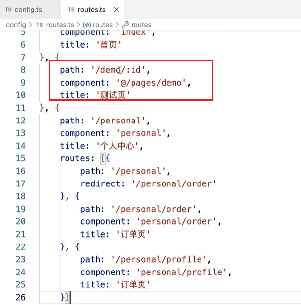
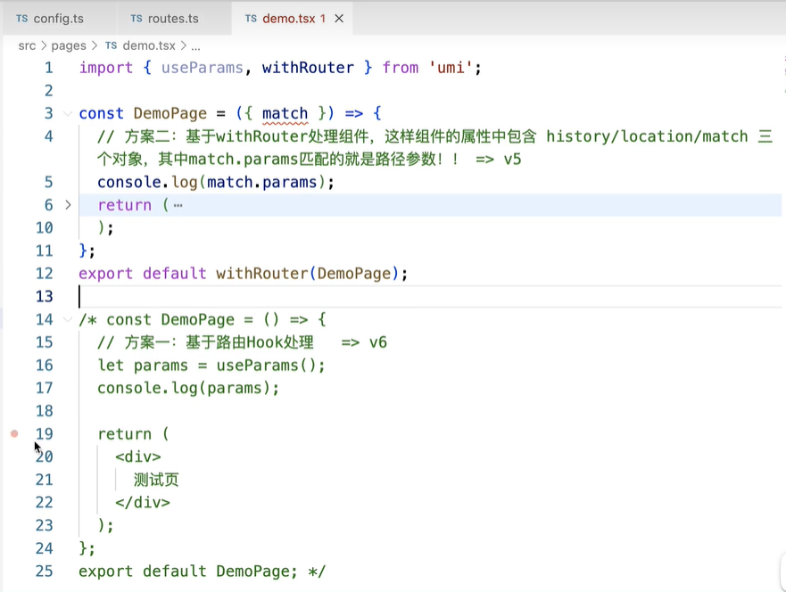

1. umi: 前端应用框架. 以路由为基础,同时支持配置式路由和约定式路由,保证路由的功能完备,并以此进行功能扩展
2. umi的配置文件 config/config.ts或者 中的一些常用的配置
    ```
    import {defineConfig} from 'umi';

    export default defineConfig({
        // 关闭所有环境下的sourcemap
        devtool: false,

        // 开启hash模式,让build后的产物包含hash后缀,常用于增量发布和避免浏览器缓存,注意HTML文件始终没有hash后缀
        hash:true,

        // 基于链式写法, 修改webpack配置
        chainWebpack(memo, {env, webpack}){
            // memo: 现有的webpack配置
            //env: 环境变量  webpack: webpack对象
        },

        // 配合headscripts可以把项目中的一些第三方模块, 单独在html中进行导入(导入的可以使CDN地址), 以此减少打包后主JS的大小
        externals:{},
        headScripts:[],

        // 额外的扩展项
        extraBabelPlugins:[],
        extraBabelPresets:[],
        extraPostCSSPlugins:[],

        // 设置路由模式
        history:{ 
            type: 'hash',
            ...
            },

        // 让 history 带上 query。除了通过 useNavigate 进行的跳转场景，此时还需自行处理 query。
        historyWithQuery: {},

        // 配置图片文件是否走base64编译的阈值,默认是10000字节(10k), 少于他会被编译为base64编码,否则会生成单独的文件
        inlineLimit: 10000,

        // 设置js的压缩方式, 默认是esbuild, 可选值还有terser, swc,uglifyJs, none
        jsMinifier: 'terser',
        jsMinifierOptions:{
            ...
        },

        // 添加额外的 link标签
        links:[],

        //添加额外的meta标签
        metas:[],

        // 配置额外的umi插件
        plugins: [],

        // 浏览器兼容处理. 默认全量导入polyfill处理es6API的兼容, 也可以手动按需导入
        polyfill:{

        },

        // 设置需要兼容的浏览器最低版本
        targets:{
            ie: 11
        },

        // 跨域代理
        proxy: {
            'api': {
                target: 'http://xxxxx.com',
                changeorigin: true,
                pathRewrite: { '^api': ''}
            }
        },

        // 设置打包后的文件中的项目入口文件html中各种资源(js/css/...)导入的路径, 默认是'/'(从根目录查找),也可以设置成CDN地址, 或者'./'表示相对路径
        <!-- publicPath: './', -->
        publicPath: process.env.NODE_ENV === 'production' ? './' : '/',

        // 使用约定式路由(路由表)
        routes: [],

        // 设置全局页面的title
        title: '',

        // 开启后会在dev模式下额外输出一份文件扫dist目录, 通常用于chrome插件,electron应用, sketch插件等开发场景
        writeToDesk: boolean
    });
    ```
3. umi的运行时配置
    - 运行时配置写在src/app.tsx中, 可以为layout
    ```
    import {matchRoutes} from 'umi';
    import { defineApp } from 'umi';

    export default defineApp({
        layout: () => {
            return {
            title: 'umi',
            };
        },
    });
    // 或者
    import { RuntimeConfig } from 'umi';
    export const layout: RuntimeConfig['layout'] = () => {
        return {
            title: 'umi',
        };
    };


    // 每一次路由切换时触发
    export function onRouteChange({ clientRoutes, location }){
        const route = matchRoutes(clientRoutes, location.hashname)?.pop()?.route;
        ...
    }

    // 如需动态更新路由，建议使用 patchClientRoutes() ，否则你可能需要同时修改 routes 和 routeComponents。
    export function patchRoutes({ routes, routeComponents }) {
        // routes: 打平的路由列表。
        // routeComponents: 路由对应的组件映射。
        console.log('patchRoutes', routes, routeComponents);
    }

    import Page from '@/extraRoutes/foo';
    export function patchClientRoutes({ routes }) {
        routes.unshift({
            path: '/foo',
            element: <Page />,
        });
    }
    
    // 如果你使用了 import { request } from 'umi'; 来请求数据，那么你可以通过该配置来自定义中间件、拦截器、错误处理适配等。具体参考 request 插件配置。
    request: {}
    ```
4. 路由处理
    1. 约定式路由: 在一个个组件里面手动写路由配置
        - 我们只要在src/pages目录下,创建出一个个的文件,则会自动创建出路由的机制
            - 以路径+文件名 作为路由地址
            - 在build后的产物目录里面可以找到route.tsx文件,里面可以查到getRoutes方法,就是路由配置表
            - 每一个组件都做了路由懒加载处理
            - 但是这样的方式不灵活, 想实现路径参数,路由地址自定义等等都不好处理
    2. 配置式路由
        - 也就是路由配置表
        - 需要在项目配置文件config中指定routes配置项的内容为路由配置表的地址
            ```
            import routes from './routes';
            export default defineConfig({
                ...
                routes: routes,
                ...
            });
            ```
        - routes.ts文件 路由配置表
         ```
            const routes = [
                {
                    path: '/',
                    // 只要指定名称即可, 会自动去pages目录下面查找; 也可以自己制定详细的目录, 比如'@/pages/index'
                    component: 'index',
                    title: '首页'
                },
                {
                    path: '/demo/:id',  // 路由地址可以用参数形式, 但是不支持加问号哦!
                    component: '@/pages/demo',
                    title: '测试页'
                },
                {
                    path: '/personal',
                    component: 'personal',
                    title: '个人中心',
                    routes: [
                        {
                            path:'/personal',
                            redirect: '/personal/order',
                        },
                        {
                            path: '/personal/order',
                            component: 'personal/order',
                            title: '订单页'
                        },
                        {
                            path: '/personal/profile',
                            component: 'personal/profile',
                            title: '订单页'
                        }
                    ],
                },
                {
                    path: '*',
                    component: '404',
                }
                
            ];

            export default routes;
         ```
        - loading.tsx 页面 
        ```
            // 路由懒加载中动态导入组件的js, 作为加载之前的loading效果
            import  {spin } from 'antd';
            import styled from 'styled-components';

            //组件样式
            const StyledLoadingBox = styled.div`
                position: fixed;
                top: 0;
                left : 0;
                z-index: 999;
                width: 100%;
                height: 100%;
                background: grba(0,0,0,.4);
                .ant-spin : {
                    position: absoulte;
                    top: 50%;
                    left: 50%;
                    transform: translate(-50%, -50%);
                };
            `;

            export default () => {
                return <StyledLoadingBox>
                    <spin  size='large' tip='加载中...'/>
                </StyledLoadingBox>
            }
        ```
        - 路由跳转方案
            - 1. Link / NavLink
            - 2. 编程式导航
                - useNavigate --->navigate()
                - history对象
        - 路由传参方案
            - 问号传参
                - 
                - 
                - 
            - 路径传参
                - 
                - 
                - 
            - 隐式传参
                - 
            - 在umi的运行时配置文件src/app.jsx中找到onRouteChange方法, 可以在这里面处理路由切换时候的一些事情
