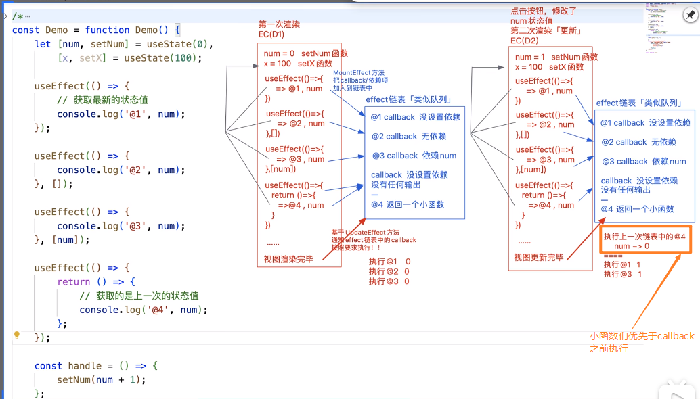
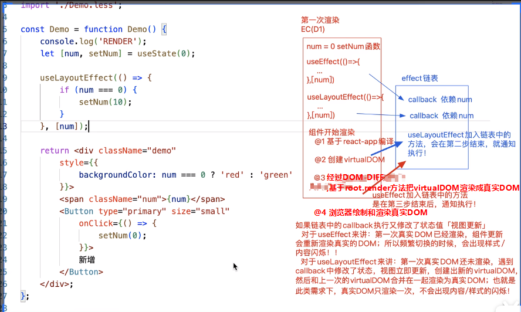

1. `useEffect(callback)`
    - 在第一次渲染完毕后，执行callback,等价于componentDidMount
    - 在组件每一次更新完毕后，也会执行callback,等价于componentDidUpdate
    - 在callback函数里面能够获取到最新的状态值
2. `useEffect(callBack，[])`
    - 只有第一次渲染完毕后， 才会执行callBack, 后面的每一次状态/视图更新，callBack都不再执行，等价于componentDidMount
3. `useEffect(callBack, [依赖的状态(可以多个)])`
    - **第一次渲染完毕后会执行callBack**
    - 当依赖的状态值(或者多个以来状态中的一个)发生改变，也会触发callBack，依赖状态都没有改变则不会触发callback的执行
4. `useEffect(() => {... return () => {...} ... })`
    - 如果useEffect的callBack里面返回了一个函数(暂且叫做小函数)，这个函数会在组件'释放'的时候执行(并非真的是释放了，在组件更新的时候的上一次视图类似于被释放，其实并没有)
        - 第一次渲染的时候返回这个小函数，在后面的每一次更新的时候都**先**执行上一次返回的这个小函数，也就是说在小函数中获取到的state都是上一次的值，再去执行其他的useEffect
5. 首次渲染会通过`MountEffect`方法把函数组件中的所有useEffect的callback放入到`effect链表`中，当视图渲染完毕，会基于`UpdateEffect`方法，通知effect链表中的callback执行(这些callBack执行时候获取到的state是最新的)。在这些useEffect的callback执行前，会先执行这些callback里面返回的小函数(这些小函数执行时候获取到的是上一次的state,因为小函数的执行上下文是在上一次哦)
    
6. useEffect不能嵌套在任何判断条件中，必须在函数组件的第一层级
7. react要求useEffect的callback函数如果有返回值，则返回值必须是一个函数(代表在组件销毁时触发)。所以，useEffect中对于需要获取异步数据后再进行的处理，不能直接给callBack添加async字段修饰，这样会返回一个promise实例，而不是函数
    - 可以在useEffect的callback函数中的异步操作添加.then链来做处理
        ```
        useEffect(() => {
            queryData().then(data => {
                ...
            })
        },[]);
        ```
    - 也可以给一部操作写成一个显示的async函数，再执行
        ```
        useEffect(() => {
            const nextFun = async () => {
                let data = await queryData();
                ...
            };
            next();
        }, [])
        ```
8. `useLayoutEffect` 和 useEffect 区别
    - 组件渲染分为三步：
        - 1 基于babel-preset-react-app把jsx编译成React.createElement(...)这种形式
        - 2 执行React.createElement(...), 得到VirtualDOM
        - 3 经过DOM-DIFF后，基于root.render方法把virtualDOM渲染成真实DOM
        - 4 浏览器渲染和绘制真实DOM对象
    - useEffect的callBack会在上述组件渲染的第4步同步开始执行,而useLayoutEffect的callback会在上述组件渲染的第3步开始执行
    - 所以，如果`effect链表`中的callBack执行里面又修改了状态值导致视图更新
        - 对于useEffect来讲，第一次真实DOM已经渲染，组件更新会重新渲染真实的DOM,所以频繁切换的时候，会出现样式/内容的闪烁
        - 对于useLayoutEffect来讲，第一次真实DOM还没有被浏览器绘制和渲染，遇到callBack中修改了状态，视图立即更新，创建出新的virtualDOM,然后和上一次的virtualDOM合并在一起渲染为真实DOM。也就是此类需求下，真实DOM只会渲染一次，不会出现样式/内容的闪烁
        
    - useEffect阻塞浏览器真实DOM的渲染，useLayoutEffect不会。在这两个设置的callBack中可以获取到真实DOM元素（真实DOM已经创建，但可能还没来及被绘制到浏览器的显示上）
    - useLayoutEffect设置的callback要优先于useEffect设置的先执行
    - 综上，如果在设置的callBack中又修改了状态值导致视图要更新：
        - 对于useEffect：浏览器把上一次真实DOM已经绘制了，再去渲染第二次真实DOM
        - 对于useLayoutEffect：浏览器把两次真实DOM的渲染合并在一起渲染，所以不会有闪烁

